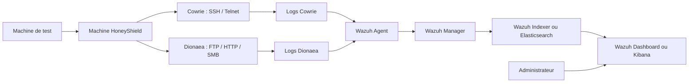

# HoneyShield : Conception et déploiement d’un environnement honeypot pour la détection et l’analyse des cyberattaques

---

## <mark style="background:#ff4d4f">1. Présentation générale du projet</mark>

### 1.1 Présentation de HoneyShield

HoneyShield est un projet de cybersécurité portant sur la conception et le déploiement d’un environnement honeypot destiné à l’observation des activités suspectes dirigées contre des services exposés. Le projet consiste à mettre en place un système leurre contrôlé, capable de recevoir des interactions non légitimes et d’enregistrer les traces associées.

L’objectif n’est pas de protéger directement un serveur de production, mais de disposer d’un environnement d’étude permettant d’analyser des comportements d’attaque dans un cadre maîtrisé. HoneyShield sert ainsi de support technique pour comprendre comment certains services exposés peuvent être découverts, sollicités ou attaqués par des utilisateurs malveillants ou des outils automatisés.

À travers ce projet, les interactions suspectes deviennent des données exploitables. Les informations collectées pourront ensuite servir à l’analyse des menaces, à l’amélioration des mécanismes de détection et à la sensibilisation aux risques liés aux systèmes exposés.

### 1.2 Domaine et périmètre du projet

Le projet s’inscrit dans le domaine de la cybersécurité, plus précisément dans les axes de la détection d’intrusion, de la supervision de sécurité, de l’analyse des journaux et de l’étude des comportements malveillants.

Le périmètre de HoneyShield est limité à un environnement de test contrôlé. Il ne s’agit pas de déployer une solution de sécurité complète pour remplacer un pare-feu, un antivirus ou un système de détection d’intrusion. Le projet vise plutôt à compléter ces approches par un dispositif d’observation technique.

Le périmètre couvre principalement :

- La mise en place d’une machine honeypot ;
- L’exposition contrôlée de services réseau simulés ;
- La collecte des journaux générés par les interactions ;
- La centralisation des événements de sécurité ;
- L’analyse des traces issues des scénarios de test ;
- La visualisation des événements dans une plateforme de supervision.

Ce cadrage permet de maintenir le projet dans une logique expérimentale, tout en conservant une orientation pratique et professionnelle.

### 1.3 Environnement cible

L’environnement cible est un réseau de laboratoire ou une infrastructure de test séparée du système d’information réel. Ce choix permet d’observer des interactions suspectes sans exposer des ressources sensibles.

L’environnement HoneyShield peut comprendre :

- Une machine honeypot basée sur Linux ;
- Des services simulés tels que SSH, Telnet, FTP, HTTP ou SMB ;
- Une machine de test utilisée pour générer des scénarios contrôlés ;
- Une solution de supervision chargée de centraliser les événements ;
- Un poste d’administration permettant de consulter les alertes et les journaux.

La séparation entre l’environnement honeypot et les systèmes réels constitue une exigence essentielle. Le honeypot doit être accessible pour les tests, mais il ne doit pas permettre un accès direct aux machines sensibles ou au réseau de production.

### 1.4 Résumé de la solution proposée

La solution proposée consiste à déployer un honeypot supervisé dans un environnement isolé. La machine HoneyShield expose des services leurres afin de recevoir des interactions suspectes. Les outils honeypot enregistrent les événements générés, puis les journaux sont transmis vers une plateforme de supervision.

Les services simulés permettront d’observer différents scénarios : scan réseau, tentative de connexion SSH, attaque par force brute, interaction avec un service exposé ou comportement automatisé. Les traces collectées seront ensuite utilisées pour identifier les éléments techniques de l’activité observée : adresse IP source, port ciblé, identifiants testés, commandes saisies, fréquence des tentatives ou événement associé.

La solution repose sur une architecture simple : un environnement honeypot pour l’exposition, une plateforme de supervision pour la collecte et l’analyse, puis un tableau de bord pour la visualisation des événements.

## <mark style="background:#ff4d4f">2. Contexte et justification du projet</mark>

### 2.1 Contexte général de la cybersécurité

Les organisations utilisent de plus en plus de services numériques pour leurs activités quotidiennes : applications web, serveurs, accès distants, bases de données, plateformes collaboratives et services cloud. Cette dépendance renforce l’importance de la cybersécurité, car les systèmes connectés deviennent des points d’entrée potentiels pour des attaques.

Les infrastructures exposées sont régulièrement soumises à des scans automatisés, à des tentatives d’authentification par force brute et à des recherches de vulnérabilités connues. Ces activités ne provoquent pas toujours un incident immédiat, mais elles constituent souvent les premières étapes d’une intrusion.

Dans ce contexte, la protection ne peut pas se limiter au blocage des attaques. Les administrateurs et analystes doivent également disposer de moyens pour observer les signaux faibles, comprendre les modes opératoires et exploiter les traces laissées par les interactions suspectes.

### 2.2 Menaces sur les systèmes exposés

Un système exposé sur un réseau peut être rapidement identifié par des outils automatisés. Les ports ouverts, les services accessibles et les versions logicielles utilisées sont des informations recherchées par les attaquants lors des phases de reconnaissance.

Les menaces les plus courantes dans ce type de contexte sont :

- Les scans de ports ;
- Les tentatives de connexion répétées ;
- Les attaques par dictionnaire ou par force brute ;
- Les requêtes suspectes vers des services web ;
- Les tentatives d’accès à des services de fichiers ;
- Les interactions automatisées provenant de scripts ou de bots.

Ces activités peuvent passer inaperçues lorsque les journaux ne sont pas centralisés ou lorsqu’aucune supervision n’est mise en place. Une détection tardive réduit la capacité à comprendre l’origine de l’activité, son déroulement et ses conséquences potentielles.

### 2.3 Nécessité d’une détection précoce

La détection précoce permet d’identifier une activité suspecte avant qu’elle ne devienne une compromission réelle. Elle facilite la réaction de l’administrateur, l’analyse des journaux et l’amélioration des règles de sécurité.

Dans le cas des services exposés, les premiers signes d’une attaque peuvent être très simples : une série de connexions échouées, un scan de ports, une requête inhabituelle ou une tentative d’accès avec un identifiant par défaut. Ces événements doivent être collectés et interprétés pour produire une information utile.

HoneyShield répond à ce besoin en proposant un environnement dédié à l’observation de ces interactions. Il permet de suivre les premières étapes d’une activité malveillante dans un cadre contrôlé, sans utiliser les systèmes réels comme terrain d’analyse.

### 2.4 Justification du choix d’un honeypot

Le choix d’un honeypot se justifie par sa capacité à créer un point d’observation volontairement contrôlé. Contrairement à un serveur de production, le honeypot n’est pas destiné à fournir un service légitime. Toute interaction avec lui peut donc être considérée comme potentiellement anormale.

Cette approche est adaptée au projet HoneyShield, car elle permet d’étudier des comportements malveillants sans exposer directement des ressources critiques. Le honeypot sert de leurre technique, tandis que la supervision permet de collecter et d’exploiter les événements générés.

Le choix d’un honeypot est également pertinent dans un cadre pédagogique. Il permet de relier les notions de cybersécurité à des observations concrètes : connexions suspectes, identifiants testés, ports ciblés, journaux produits et alertes générées.

## <mark style="background:#ff4d4f">3. Problématique</mark>

### 3.1 Constats techniques

Les services exposés tels que SSH, FTP, HTTP, Telnet ou SMB sont régulièrement visés par des outils de reconnaissance et des tentatives d’accès automatisées. Lorsqu’une organisation ne dispose pas d’une bonne visibilité sur ces interactions, certaines activités suspectes peuvent rester invisibles jusqu’à l’apparition d’un incident.

Les journaux système contiennent souvent des informations utiles, mais celles-ci peuvent être dispersées, volumineuses ou difficiles à interpréter. Leur exploitation nécessite une collecte organisée, une centralisation et une analyse adaptée.

### 3.2 Problème principal identifié

Le problème principal est la difficulté à observer et analyser les comportements suspects visant des services exposés sans mettre en danger les systèmes réels.

Utiliser un système de production comme support d’observation serait risqué. Il faut donc disposer d’un environnement séparé, contrôlé et supervisé, capable de recevoir des interactions suspectes et de générer des données exploitables pour l’analyse.

### 3.3 Questions techniques du projet

La réalisation du projet soulève plusieurs questions techniques :

- Comment concevoir une architecture honeypot isolée et sécurisée ?
- Quels services exposer pour obtenir des interactions observables ?
- Comment collecter les journaux générés par les outils honeypot ?
- Comment centraliser les événements dans une plateforme de supervision ?
- Comment analyser les traces afin d’identifier les comportements suspects ?
- Comment vérifier que les scénarios de test produisent des événements exploitables ?
- Comment présenter les résultats de manière claire dans un tableau de bord ?

Ces questions orientent la conception, la mise en œuvre et l’évaluation de HoneyShield.

### 3.4 Hypothèse de solution

L’hypothèse retenue est qu’un honeypot isolé, associé à une solution de supervision, peut fournir un environnement pertinent pour observer des interactions suspectes et produire des données utiles à l’analyse des menaces.

Dans cette approche, Cowrie permet d’étudier les interactions SSH et Telnet, Dionaea élargit l’observation à d’autres services exposés, et Wazuh centralise les événements afin de faciliter leur exploitation. Cette hypothèse sera vérifiée à travers le déploiement de la solution et la simulation contrôlée de scénarios d’attaque.

## <mark style="background:#ff4d4f">4. Objectifs du projet</mark>

### 4.1 Objectif général

L’objectif général du projet HoneyShield est de concevoir et déployer un environnement honeypot isolé et supervisé permettant d’observer des interactions suspectes, de collecter les journaux associés et de faciliter l’analyse des comportements malveillants dans un cadre contrôlé.

### 4.2 Objectifs spécifiques

Pour atteindre cet objectif général, le projet vise à :

- Concevoir une architecture honeypot isolée ;
- Définir les services leurres à exposer ;
- Installer et configurer les outils honeypot retenus ;
- Collecter les journaux générés par les interactions ;
- Centraliser les événements dans une solution de supervision ;
- Réaliser des simulations contrôlées ;
- Identifier les informations utiles dans les journaux ;
- Visualiser les événements dans un tableau de bord ;
- Évaluer l’apport de l’environnement dans l’observation des attaques ;
- Proposer des pistes d’amélioration.

Ces objectifs structurent le projet depuis la conception jusqu’à l’analyse finale des résultats.

## <mark style="background:#ff4d4f">5. Intérêt du projet</mark>

### 5.1 Intérêt pédagogique

Le projet présente un intérêt pédagogique, car il permet de mettre en pratique des notions parfois abstraites de cybersécurité. Les apprenants peuvent observer des événements concrets : scan réseau, tentative de connexion, test d’identifiants, génération de logs et apparition d’alertes.

HoneyShield constitue ainsi un support d’apprentissage pour comprendre le lien entre une activité réseau, une trace système et une analyse de sécurité. Il favorise l’apprentissage par la pratique et développe la capacité à interpréter des événements techniques.

### 5.2 Intérêt technique

Sur le plan technique, le projet mobilise plusieurs compétences liées à l’administration système, à la configuration réseau, à la supervision et à la gestion des journaux.

Il permet notamment de travailler sur :

- L’installation d’un serveur Linux ;
- La configuration d’un environnement isolé ;
- Le déploiement de services simulés ;
- La collecte de journaux techniques ;
- L’intégration d’un agent de supervision ;
- L’analyse d’événements dans un tableau de bord.

Cet intérêt technique rend le projet utile pour renforcer les compétences pratiques nécessaires en cybersécurité opérationnelle.

### 5.3 Intérêt en cybersécurité

En cybersécurité, HoneyShield permet d’étudier des comportements qui apparaissent fréquemment autour des services exposés. Les données collectées peuvent aider à comprendre les ports ciblés, les identifiants testés, les séquences d’actions et la fréquence des tentatives.

Le projet contribue également à une démarche de détection. Il ne se limite pas à constater qu’une attaque existe ; il cherche à produire des traces exploitables pour l’analyse, la corrélation et l’amélioration des mécanismes de sécurité.

### 5.4 Intérêt pour une organisation

Pour une organisation, un honeypot peut servir d’outil complémentaire dans une stratégie de cybersécurité. Il peut aider les équipes techniques à mieux comprendre les activités suspectes qui visent leur environnement, tout en restant séparé des systèmes sensibles.

Les résultats issus de HoneyShield peuvent être utilisés pour renforcer les règles de sécurité, sensibiliser les utilisateurs, améliorer la supervision et préparer des procédures de réponse aux incidents.

---

# <mark style="background:rgba(205, 244, 105, 0.55)">Partie I : Cadre théorique</mark>


## <mark style="background:#ff4d4f">6. Généralités sur les honeypots</mark>

### 6.1 Définition d’un honeypot

Un honeypot est un système leurre conçu pour attirer des interactions suspectes dans un environnement contrôlé. Il peut simuler un serveur, un service réseau ou une application afin d’observer les comportements d’un attaquant ou d’un outil automatisé.

Contrairement à un système de production, un honeypot n’a pas pour objectif de fournir un service légitime aux utilisateurs. Toute interaction avec ce système est donc considérée comme potentiellement anormale.

Les données collectées par un honeypot peuvent inclure les adresses IP sources, les ports ciblés, les identifiants testés, les commandes exécutées, les fichiers déposés ou les tentatives d’exploitation.

### 6.2 Rôle d’un honeypot en cybersécurité

Le rôle d’un honeypot est de fournir un environnement d’observation capable de produire des informations sur des comportements malveillants. Il peut aider à repérer des activités qui précèdent une intrusion, comme un scan, une tentative de connexion ou une interaction avec un service vulnérable.

En cybersécurité, le honeypot joue trois rôles principaux :

- Un rôle de détection, car toute interaction avec lui peut être suspecte ;
- Un rôle d’observation, car il permet de suivre les actions réalisées ;
- Un rôle d’analyse, car les traces collectées peuvent être étudiées.

Il ne remplace pas les solutions classiques de sécurité, mais il les complète en apportant une visibilité différente sur les activités hostiles.

### 6.3 Fonctionnement général d’un honeypot

Le fonctionnement d’un honeypot repose sur trois étapes principales.

D’abord, le système expose un ou plusieurs services simulés. Ces services peuvent ressembler à des services réels afin d’attirer les interactions suspectes.

Ensuite, les interactions sont enregistrées. Le honeypot collecte les informations associées à l’activité observée : source de connexion, service sollicité, identifiants saisis, commandes exécutées ou fichiers transférés.

Enfin, les données sont analysées. Cette analyse peut être réalisée directement à partir des journaux ou à travers une solution de supervision capable de centraliser les événements.

Le fonctionnement peut être résumé ainsi :

| Étape | Description |
|---|---|
| Exposition | Le honeypot présente des services accessibles |
| Interaction | Un attaquant ou un outil automatisé contacte le service |
| Journalisation | Les actions sont enregistrées dans des logs |
| Analyse | Les traces sont exploitées pour comprendre l’activité |

### 6.4 Types de honeypots selon le niveau d’interaction

Les honeypots peuvent être classés selon leur <font color="#4f6128">niveau d’interaction</font>, c’est-à-dire selon le degré de réalisme offert à l’attaquant. On distingue généralement les honeypots à <font color="#e36c09">faible interaction</font>, à <font color="#974806">moyenne interaction</font> et à <font color="#ff0000">forte interaction</font>.

| Type de honeypot | Principe | Avantages | Limites |
|---|---|---|---|
| Faible interaction | Simule des services ou réponses limitées | Simple à déployer, moins risqué | Données collectées limitées |
| Moyenne interaction | Offre des interactions plus réalistes sans fournir un système complet | Bon équilibre entre sécurité et richesse des traces | Configuration plus complexe |
| Forte interaction | Fournit un environnement très proche d’un vrai système | Observation détaillée des actions de l’attaquant | Risque élevé, besoin d’isolation stricte |

<font color="#e36c09">Un honeypot à faible interaction</font> est adapté lorsqu’on souhaite détecter des scans, des connexions suspectes ou des tentatives simples. Il est plus facile à mettre en place et limite les risques, mais il fournit moins de détails sur les actions de l’attaquant.

![[Pasted image 20260529000306.png]]

<font color="#974806">Un honeypot à moyenne interaction</font> offre davantage de réalisme sans donner accès à un système complet. Il permet de collecter des traces plus riches tout en conservant un meilleur contrôle sur l’environnement.

![[Pasted image 20260529000801.png]]

<font color="#ff0000">Un honeypot à forte interaction</font> fournit un environnement très proche d’un vrai système. Il permet une observation plus détaillée, mais il exige une isolation stricte, car l’attaquant peut tenter d’utiliser l’environnement compromis comme point de rebond.

![[Pasted image 20260529001101.png]]

Dans le cadre de HoneyShield, le modèle retenu correspond à un honeypot à faible interaction enrichi par certains mécanismes de moyenne interaction. Il ne fournit pas un véritable système complet à l’attaquant, mais il simule plusieurs services réseau afin de collecter des informations sur les tentatives de connexion, les identifiants testés, les commandes saisies et les interactions avec les services exposés.

### 6.5 Honeypot de recherche et honeypot de production

Les honeypots peuvent également être distingués selon leur finalité.

Un honeypot de recherche est utilisé pour comprendre les techniques employées par les attaquants. Il est souvent déployé dans un cadre académique, expérimental ou de veille. Son objectif principal est la collecte d’informations et l’étude des comportements.

Un honeypot de production est intégré dans une infrastructure opérationnelle afin de détecter rapidement des activités suspectes. Il doit être discret, bien isolé et correctement supervisé pour ne pas introduire de nouveaux risques dans l’environnement.

HoneyShield se rapproche davantage d’un honeypot de recherche et d’apprentissage, car il vise à observer, analyser et comprendre des scénarios d’attaque dans un environnement de test contrôlé.

### 6.6 Indicateurs observables dans un honeypot

Un honeypot permet de collecter plusieurs indicateurs utiles pour l’analyse de sécurité. Ces indicateurs facilitent l’identification des comportements, la comparaison des événements et la préparation des résultats.

Les indicateurs observables sont notamment :

- L’adresse IP source ;
- L’horodatage de l’événement ;
- Le port ciblé ;
- Le protocole utilisé ;
- Le service sollicité ;
- Les identifiants testés ;
- Les mots de passe saisis ;
- Les commandes exécutées ;
- Les fichiers téléchargés ou déposés ;
- La fréquence des tentatives ;
- La séquence d’actions.

Ces éléments seront utiles dans la partie pratique pour interpréter les événements générés par les simulations.

### 6.7 Avantages des honeypots

Les honeypots présentent plusieurs avantages. Ils permettent d’obtenir des signaux généralement plus faciles à interpréter, car un service leurre n’est pas censé recevoir d’activité légitime.

Ils offrent également une source de données utile pour comprendre les méthodes d’attaque. Les journaux peuvent révéler les services ciblés, les identifiants essayés, les commandes saisies ou les fichiers déposés.

Un autre avantage est leur intérêt pédagogique. Ils permettent d’observer directement des comportements suspects dans un environnement maîtrisé, ce qui facilite la compréhension des mécanismes d’attaque et de détection.

Enfin, les honeypots peuvent contribuer à améliorer une stratégie de défense en fournissant des informations exploitables pour ajuster les règles de supervision, renforcer les configurations et sensibiliser les utilisateurs.

### 6.8 Limites et risques des honeypots

Malgré leur intérêt, les honeypots présentent plusieurs limites. Ils ne remplacent pas les mécanismes classiques de sécurité tels que les pare-feu, les systèmes de détection d’intrusion, les politiques de mots de passe ou les solutions de supervision. Leur rôle est complémentaire.

Un honeypot ne détecte que les attaques qui interagissent avec lui. Si un attaquant cible directement un autre système du réseau, le honeypot peut ne générer aucune alerte. Son efficacité dépend donc de son positionnement, de sa crédibilité et de sa capacité à attirer des interactions suspectes.

Le principal risque concerne la compromission de l’environnement. Si le honeypot est mal isolé, il peut être utilisé comme point de rebond vers d’autres systèmes. Pour cette raison, l’isolation réseau, la limitation des flux sortants, la supervision continue et la centralisation des journaux sont indispensables.

Enfin, l’utilisation d’un honeypot doit respecter un cadre légal et éthique. Il doit être utilisé pour observer et analyser des comportements dans un environnement autorisé, sans mener d’actions offensives contre des tiers.

## <mark style="background:#ff4d4f">7. Activités malveillantes observables par HoneyShield</mark>

### 7.1 Introduction

HoneyShield ne vise pas à couvrir toutes les formes de cyberattaques. Le projet se concentre sur des activités techniques observables dans un environnement honeypot : scans réseau, tentatives d’authentification, connexions SSH suspectes, interactions avec des services exposés et comportements automatisés.

Ces activités ont été retenues parce qu’elles peuvent être reproduites dans un laboratoire et générer des journaux exploitables.

### 7.2 Scan réseau

Le scan réseau consiste à rechercher les machines actives, les ports ouverts et les services disponibles. Il constitue souvent une phase de reconnaissance avant une tentative d’exploitation.

Dans HoneyShield, le scan réseau permettra de vérifier la visibilité des services exposés et de produire des traces exploitables dans les journaux. Les informations observables peuvent concerner les ports interrogés, l’adresse IP source et la fréquence des requêtes.

### 7.3 Attaque par force brute

L’attaque par force brute consiste à tester plusieurs combinaisons d’identifiants et de mots de passe pour obtenir un accès non autorisé. Elle est fréquente contre les services d’administration à distance comme SSH ou Telnet.

Dans HoneyShield, ce scénario permettra d’observer les noms d’utilisateurs testés, les mots de passe saisis, le nombre de tentatives et le rythme de l’attaque.

### 7.4 Connexion SSH suspecte

Une connexion SSH devient suspecte lorsqu’elle provient d’une source inconnue, utilise des identifiants faibles ou génère plusieurs échecs d’authentification. Après une connexion simulée, certaines commandes peuvent également révéler les intentions de l’attaquant.

Cowrie sera utilisé pour observer ce type d’activité. Il permettra de collecter les identifiants testés, les sessions ouvertes et les commandes saisies dans l’environnement simulé.

### 7.5 Interaction avec des services exposés

Les services exposés comme FTP, HTTP ou SMB peuvent recevoir des requêtes suspectes, des tentatives d’accès ou des interactions liées à la recherche de vulnérabilités.

Dans HoneyShield, Dionaea pourra compléter l’observation en simulant plusieurs services réseau. L’objectif est d’élargir la surface d’observation au-delà de SSH et Telnet, sans donner accès à un véritable serveur de production.

### 7.6 Comportements automatisés ou attaques par bots

De nombreuses interactions malveillantes sont produites par des scripts ou des bots. Ces comportements se reconnaissent souvent par leur répétition, leur rapidité et la similarité des actions réalisées.

Dans HoneyShield, ces activités pourront être identifiées à travers les tentatives répétées, les séquences de connexion, les ports ciblés et les identifiants fréquemment utilisés.

---

# <mark style="background:rgba(205, 244, 105, 0.55)">Partie II : Conception de la solution HoneyShield</mark>

## <mark style="background:#ff4d4f">8. Conception technique de HoneyShield</mark>

### 8.1 Principe de conception retenu

La conception de HoneyShield repose sur un environnement honeypot isolé, supervisé et organisé en plusieurs zones. Le principe est de séparer la partie exposée, qui reçoit les interactions suspectes, de la partie supervision, qui centralise et analyse les journaux.

Le modèle retenu correspond à un honeypot à faible interaction enrichi par certains mécanismes de moyenne interaction. Les services ne donnent pas accès à un système complet, mais ils permettent de collecter suffisamment de traces pour l’analyse.

### 8.2 Architecture générale

L’architecture générale comprend quatre éléments principaux :

- Une machine honeypot chargée d’exposer les services simulés ;
- Des outils honeypot chargés d’enregistrer les interactions ;
- Une plateforme Wazuh chargée de centraliser et traiter les événements ;
- Un poste d’administration chargé de consulter les alertes et les journaux.

| Élément | Rôle |
|---|---|
| Machine HoneyShield | Héberge les services simulés |
| Cowrie | Simule SSH et Telnet |
| Dionaea | Simule plusieurs services réseau |
| Wazuh Agent | Transmet les journaux au serveur Wazuh |
| Wazuh Manager | Centralise et analyse les événements |
| Wazuh Indexer ou Elasticsearch | Stocke et indexe les données |
| Wazuh Dashboard ou Kibana | Permet la visualisation |
| Poste d’administration | Permet l’analyse des résultats |
| Machine de test | Génère les scénarios contrôlés |

### 8.3 Organisation réseau et zones de sécurité

L’environnement est organisé en trois zones :

| Zone | Rôle | Exposition |
|---|---|---|
| Zone honeypot | Reçoit les interactions suspectes | Exposée aux tests |
| Zone supervision | Centralise les journaux et alertes | Protégée |
| Zone administration | Permet la consultation des résultats | Accès réservé |

La zone honeypot doit être séparée du réseau réel. Elle peut être placée dans un réseau de test, un VLAN dédié, une DMZ ou un segment isolé. Les flux sortants doivent être limités pour éviter tout rebond vers d’autres systèmes.

La zone supervision ne doit pas être exposée directement aux sources d’attaque. Elle reçoit uniquement les journaux transmis par le honeypot. La zone administration doit être réservée aux personnes autorisées.

### 8.4 Services exposés

<mark style="background:#b1ffff">Dans HoneyShield, les services exposés retenus sont SSH, Telnet, FTP, HTTP et SMB. Ils sont simulés pour produire des journaux exploitables, sans fournir de véritables services de production.</mark>

Les services retenus pour HoneyShield sont les suivants :

| Service | Port courant | Outil associé | Objectif d’observation |
|---|---:|---|---|
| SSH | 22 | Cowrie | Tentatives de connexion et force brute |
| Telnet | 23 | Cowrie | Connexions faibles ou automatisées |
| FTP | 21 | Dionaea | Tentatives d’accès à un service de fichiers |
| HTTP | 80 | Dionaea ou service web leurre | Requêtes web suspectes |
| SMB | 445 | Dionaea | Interactions liées aux partages réseau |

Ces services sont choisis parce qu’ils correspondent à des surfaces d’attaque fréquemment recherchées lors des scans et des tentatives d’accès automatisées.

### 8.5 Choix des composants techniques

Linux est retenu comme système de base en raison de sa stabilité, de sa flexibilité et de sa compatibilité avec les outils de cybersécurité.

Cowrie est utilisé pour simuler SSH et Telnet. Il permet de collecter les identifiants testés, les mots de passe saisis, les sessions ouvertes et les commandes exécutées dans l’environnement simulé.

Dionaea complète Cowrie en simulant plusieurs services réseau. Il permet de capturer des interactions suspectes, notamment des tentatives d’exploitation, des connexions anormales ou des transferts de fichiers suspects.

Wazuh Agent est installé sur la machine honeypot afin de surveiller les fichiers de journaux et de transmettre les événements vers Wazuh Manager.

Wazuh Manager assure la centralisation et l’analyse des événements. Il applique des règles, génère des alertes et facilite l’exploitation des données collectées.

Wazuh Indexer ou Elasticsearch assure le stockage et l’indexation des événements, ce qui permet les recherches et les filtres dans le tableau de bord.

Wazuh Dashboard ou Kibana fournit l’interface de visualisation des alertes, des journaux et des statistiques.

Nmap est utilisé comme outil de test pour vérifier l’exposition des services et générer des scénarios de scan contrôlés.

### 8.6 Flux de fonctionnement

Le fonctionnement de HoneyShield suit une chaîne simple :

| Étape | Action | Composant concerné |
|---|---|---|
| 1 | Une machine de test contacte un service exposé | Honeypot |
| 2 | L’interaction est reçue | Cowrie ou Dionaea |
| 3 | L’événement est enregistré | Journaux locaux |
| 4 | Le journal est collecté | Wazuh Agent |
| 5 | L’événement est transmis | Wazuh Manager |
| 6 | Les données sont indexées | Wazuh Indexer ou Elasticsearch |
| 7 | Les alertes sont consultées | Wazuh Dashboard ou Kibana |
| 8 | Les résultats sont interprétés | Analyste sécurité |

Cette chaîne permet de suivre le cheminement complet d’un événement depuis son apparition jusqu’à son analyse.

### 8.7 Mesures de sécurisation prévues

La conception prévoit plusieurs mesures de sécurité :

- Isoler la machine honeypot du réseau réel ;
- Limiter les flux sortants du honeypot ;
- Protéger l’accès au tableau de bord ;
- Centraliser les journaux en dehors du honeypot ;
- Utiliser des comptes d’administration protégés ;
- Réaliser les tests uniquement dans un cadre autorisé.

Ces mesures réduisent le risque que le honeypot soit utilisé comme point de rebond ou comme source d’attaque vers un système tiers.

### 8.8 Schéma global de l’architecture



### 8.9 Synthèse de la conception

La conception retenue repose sur une architecture isolée, modulaire et supervisée. Le honeypot expose des services simulés, les outils spécialisés enregistrent les interactions, et Wazuh centralise les événements pour faciliter l’analyse.

Cette conception prépare la phase de mise en œuvre, qui consistera à installer les composants, configurer les services, connecter le honeypot à la supervision et vérifier le fonctionnement global.

---

# <mark style="background:rgba(205, 244, 105, 0.55)">Partie III : Mise en œuvre de HoneyShield</mark>

## <mark style="background:#ff4d4f">9. Déploiement de l’environnement HoneyShield</mark>

### 9.1 Préparation du laboratoire de virtualisation

La première étape de la mise en œuvre de HoneyShield consiste à préparer l’environnement de virtualisation destiné à accueillir les différentes machines du projet. Cette phase est essentielle, car elle permet de définir l’infrastructure technique nécessaire au déploiement des composants du système, notamment le honeypot, la plateforme de supervision et les outils de test.

Le choix d’un environnement virtualisé permet de mettre en place une architecture isolée, flexible et maîtrisée. Cette approche facilite le déploiement des différentes machines tout en assurant une séparation avec l’environnement de production ou le réseau réel. Elle offre également un cadre adapté aux expérimentations et aux analyses de sécurité dans des conditions contrôlées.

Dans le cadre de HoneyShield, le laboratoire doit comporter trois machines virtuelles principales :

|Machine virtuelle|Système prévu|Rôle dans le laboratoire|
|---|---|---|
|VM HoneyShield|Ubuntu Server|Héberger le honeypot, Cowrie, Dionaea et l’agent Wazuh|
|VM Wazuh Server|Ubuntu Server|Centraliser, analyser et visualiser les événements|
|VM Kali Linux|Kali Linux|Réaliser les scans et les simulations contrôlées|

La machine **HoneyShield** représente la machine exposée du laboratoire. Elle sera utilisée pour installer les services honeypot et collecter les interactions suspectes.

La machine **Wazuh Server** représente la plateforme de supervision. Elle recevra les journaux transmis par l’agent installé sur la machine HoneyShield et permettra de consulter les alertes dans un tableau de bord.

La machine **Kali Linux** représente la machine de test. Elle servira à générer les scénarios contrôlés, notamment les scans réseau, les tentatives de connexion et les interactions avec les services exposés.

Pour réaliser ce laboratoire, un hyperviseur doit être utilisé. Selon les ressources disponibles, il peut s’agir de VMware Workstation, VirtualBox ou VMware ESXi. Dans ce projet, l’utilisation d’un environnement virtualisé est retenue afin de mieux contrôler les machines et leurs communications.

Les ressources minimales recommandées pour les machines virtuelles sont les suivantes :

| Machine virtuelle | Processeur | Mémoire RAM | Disque dur recommandé |
| ----------------- | ---------- | ----------- | --------------------- |
| VM HoneyShield    | 2 vCPU     | 2 Go à 4 Go | 30 Go                 |
| VM Wazuh Server   | 2 à 4 vCPU | 4 Go à 8 Go | 50 Go ou plus         |
| VM Kali Linux     | 2 vCPU     | 2 Go à 4 Go | 30 Go                 |
|                   |            |             |                       |

Ces ressources peuvent être adaptées selon la puissance de la machine physique utilisée. La machine Wazuh Server nécessite davantage de ressources, car elle assure la centralisation, l’indexation et la visualisation des événements.

Avant de créer les machines virtuelles, il est nécessaire de préparer les fichiers d’installation suivants :

- L’image ISO d’Ubuntu Server pour la machine HoneyShield ;
    
- L’image ISO d’Ubuntu Server pour la machine Wazuh Server ;
    
- L’image ISO de Kali Linux pour la machine de test ;
    
- Un espace disque suffisant pour stocker les machines virtuelles ;
    
- Une connexion Internet temporaire pour télécharger les paquets nécessaires.
    

Le réseau virtuel du laboratoire doit également être défini dès cette étape. L’objectif est de permettre aux machines virtuelles de communiquer entre elles tout en évitant une exposition directe du réseau réel. Selon l’hyperviseur utilisé, le réseau peut être configuré sous forme de LAN Segment, de réseau interne, de Host-Only Network ou de VLAN isolé.

Le plan d’adressage prévu pour le laboratoire est le suivant :

| Équipement   | Adresse IP prévue | Rôle                                               |
| ------------ | ----------------- | -------------------------------------------------- |
| Kali Linux   | 192.168.163.135   | Machine de test                                    |
| HoneyShield  | 192.168.163.145   | Machine honeypot                                   |
| Wazuh Server | 192.168.163.155   | Plateforme de supervision                          |
| Passerelle   | 192.168.163.1     | Accès réseau selon la configuration du laboratoire |

À cette étape, les adresses IP ne sont pas encore configurées dans les machines. Elles sont simplement définies comme plan d’adressage prévisionnel. La configuration réelle des interfaces réseau sera effectuée dans la section suivante consacrée à la configuration réseau.

La préparation du laboratoire doit donc permettre de disposer d’un environnement clair avant l’installation des systèmes. Les machines à créer sont identifiées, leurs rôles sont définis, les ressources nécessaires sont précisées et le réseau virtuel à utiliser est prévu.

À la fin de cette étape, le laboratoire est prêt pour la création et l’installation des machines virtuelles. La suite du déploiement consistera à installer Ubuntu Server sur les machines HoneyShield et Wazuh Server, puis Kali Linux sur la machine de test.

### 9.2 Création et installation des machines virtuelles

Après la préparation du laboratoire de virtualisation, l’étape suivante consiste à créer et installer les différentes machines virtuelles nécessaires au projet HoneyShield. Cette étape permet de disposer des systèmes de base sur lesquels seront ensuite installés les outils du projet.

Dans le cadre de ce travail, la création détaillée des machines virtuelles ne sera pas développée commande par commande, car elle dépend de l’hyperviseur utilisé par chaque utilisateur. Certains peuvent utiliser VMware Workstation, d’autres VirtualBox ou VMware ESXi. Les interfaces, les menus et les options peuvent donc varier selon l’environnement choisi.

Pour cette raison, les utilisateurs devront suivre des vidéos YouTube adaptées à leur outil de virtualisation afin de créer correctement les machines virtuelles du laboratoire. Ces vidéos devront couvrir les opérations suivantes :

- La Création d’une machine virtuelle Ubuntu Server ;
    
- L’Installation d’Ubuntu Server ;
    
- La Création d’une machine virtuelle Kali Linux ;
    
- L’Installation de Kali Linux ;
    
- La Configuration de base des ressources matérielles ;
    
- L’Ajout d’une carte réseau virtuelle ;
    
- Le Choix du mode réseau adapté au laboratoire.
    

Les vidéos recommandées devront permettre à l’utilisateur de mettre en place les trois machines nécessaires au projet :

|Machine virtuelle|Système à installer|Rôle|
|---|---|---|
|VM HoneyShield|Ubuntu Server|Machine honeypot|
|VM Wazuh Server|Ubuntu Server|Plateforme de supervision|
|VM Kali Linux|Kali Linux|Machine de test|

L’utilisateur devra veiller à respecter les ressources minimales prévues lors de la création des machines virtuelles. La machine HoneyShield doit disposer de ressources suffisantes pour exécuter les outils honeypot et l’agent Wazuh. La machine Wazuh Server doit disposer de ressources plus importantes, car elle assurera la centralisation, l’indexation et la visualisation des événements. La machine Kali Linux servira uniquement aux tests et aux simulations contrôlées.

À la fin de cette étape, les trois machines virtuelles doivent être créées et installées. Les systèmes doivent démarrer correctement et permettre l’accès à une session utilisateur ou administrateur. Il n’est pas encore nécessaire de configurer les adresses IP définitives à ce niveau, car la configuration réseau sera traitée dans la section suivante.

Les éléments attendus à la fin de cette étape sont les suivants :

- Une Machine virtuelle HoneyShield fonctionnelle sous Ubuntu Server ;
    
- Une Machine virtuelle Wazuh Server fonctionnelle sous Ubuntu Server ;
    
- Une Machine virtuelle Kali Linux fonctionnelle ;
    
- Des Ressources matérielles correctement attribuées à chaque machine ;
    
- Un Accès administrateur disponible sur chaque système ;
    
- Des Machines prêtes pour la configuration réseau.
    

Cette étape constitue donc une phase préparatoire importante. Elle permet de disposer des systèmes nécessaires avant de passer à la configuration réseau, à l’installation des outils honeypot et à la mise en place de la supervision.

#### <font color="#76923c"> Ressources vidéo recommandées pour la création des machines virtuelles</font>

La création et l’installation des machines virtuelles peuvent varier selon l’hyperviseur utilisé. Pour faciliter cette étape, les utilisateurs sont invités à consulter des vidéos adaptées à leur environnement de travail. Les ressources suivantes sont proposées selon les cas.

##### Cas 1 : Utilisateur francophone utilisant VMware Workstation

|Besoin|Vidéo recommandée|
|---|---|
|Créer une machine virtuelle avec VMware Workstation|[Débuter avec VMware Workstation Pro - Épisode 1 : Créer une VM](https://www.youtube.com/watch?v=KCeX-65ohRA)|
|Comprendre les réseaux VMware : NAT, Bridged, Host-only, LAN Segment|[VMware Workstation Pro - Épisode 2 : Réseau NAT, Bridged, Host-only, LAN Segment](https://www.youtube.com/watch?v=hj-deoZA4do)|
|Installer Kali Linux avec VMware ou VirtualBox|[Tuto FR : Installation de Kali Linux avec VirtualBox ou VMware Workstation](https://www.youtube.com/watch?v=EuFkR8GtH6A)|

##### Cas 2 : Utilisateur anglophone utilisant VMware Workstation

|Besoin|Vidéo recommandée|
|---|---|
|Installer Ubuntu Server 24.04 sur VMware Workstation|[Install Ubuntu Server 24.04 on VMware Workstation step by step](https://www.youtube.com/watch?v=tgxBrcxRYic)|
|Installer Ubuntu Server 22.04 sur VMware Workstation|[Install Ubuntu 22.04.5 LTS Server on VMware Workstation](https://www.youtube.com/watch?v=tkXQAeMYZwA)|
|Installer et configurer Ubuntu Server sur VMware|[How to Install and Configure Ubuntu Server on VMware](https://www.youtube.com/watch?v=NdzSg_MvuoE)|
|Installer Kali Linux sur VMware Workstation|[How to Install Kali Linux in VMware Workstation](https://www.youtube.com/watch?v=ZjAK_m5j8fA)|
|Créer un réseau LAN dans VMware|[How to Create a LAN in VMware - Step by Step](https://www.youtube.com/watch?v=6fjjX6M9UV0)|

##### Cas 3 : Utilisateur francophone utilisant VirtualBox

|Besoin|Vidéo recommandée|
|---|---|
|Installer Ubuntu Server dans VirtualBox|[Installer un Serveur Linux dans VirtualBox - Ubuntu Server](https://www.youtube.com/watch?v=AZeQqf0W-10)|
|Installer Kali Linux avec VirtualBox ou VMware|[Tuto FR : Installation de Kali Linux avec VirtualBox ou VMware Workstation](https://www.youtube.com/watch?v=EuFkR8GtH6A)|
|Comprendre les modes réseau VirtualBox|[Types de réseaux VirtualBox : NAT, pont, host-only, etc.](https://www.it-connect.fr/comprendre-les-differents-types-de-reseaux-virtualbox/)|

##### Cas 4 : Utilisateur anglophone utilisant VirtualBox

|Besoin|Vidéo recommandée|
|---|---|
|Installer Ubuntu Server 22.04 dans VirtualBox|[Install Ubuntu Server 22.04 LTS in VirtualBox](https://www.youtube.com/watch?v=ElNalqvVaPw)|
|Installer Ubuntu Server 22.04 étape par étape|[How to Install Ubuntu Server 22.04 LTS - Step by Step](https://www.youtube.com/watch?v=2ZAhNQEWtm4)|
|Configurer un réseau Host-only avec Ubuntu et Kali dans VirtualBox|[Host Only Network on VirtualBox - Demo using Ubuntu and Kali Linux](https://www.youtube.com/watch?v=EmXeUlZnbwk)|
|Activer NAT et Host-only Network sur Ubuntu Server dans VirtualBox|[How to enable NAT and host only network on Ubuntu Server in VirtualBox](https://www.youtube.com/watch?v=PEL0e51oeaE)|

##### Cas 5 : Installation spécifique d’Ubuntu Server

|Besoin|Vidéo recommandée|
|---|---|
|Installer Ubuntu Server 24.04 sur VMware Workstation|[Install Ubuntu Server 24.04 on VMware Workstation step by step](https://www.youtube.com/watch?v=tgxBrcxRYic)|
|Installer Ubuntu Server 22.04.5 sur VMware Workstation|[Install Ubuntu 22.04.5 LTS Server on VMware Workstation](https://www.youtube.com/watch?v=tkXQAeMYZwA)|
|Installer Ubuntu Server 22.04 dans VirtualBox|[Install Ubuntu Server 22.04 LTS in VirtualBox](https://www.youtube.com/watch?v=ElNalqvVaPw)|
|Installer Ubuntu Server 22.04 étape par étape|[How to Install Ubuntu Server 22.04 LTS - Step by Step](https://www.youtube.com/watch?v=2ZAhNQEWtm4)|

##### Recommandation pour HoneyShield

Pour le projet HoneyShield, le parcours recommandé est le suivant :

|Étape|Ressource conseillée|
|---|---|
|1|Créer les machines virtuelles avec VMware Workstation ou VirtualBox|
|2|Installer Ubuntu Server pour la machine HoneyShield|
|3|Installer Ubuntu Server pour la machine Wazuh Server|
|4|Installer Kali Linux pour la machine de test|
|5|Configurer un réseau isolé de type Host-only, LAN Segment ou réseau interne|
|6|Vérifier que les trois machines peuvent communiquer entre elles avant de poursuivre|

### 9.3 Configuration réseau des machines

Après la création et l’installation des machines virtuelles, l’étape suivante consiste à configurer le réseau du laboratoire. Dans le cadre de ce projet, les machines virtuelles sont placées dans un réseau de type NAT.

Le choix du réseau NAT se justifie par le besoin de permettre aux machines virtuelles d’accéder à Internet afin de télécharger les paquets nécessaires à l’installation des outils, notamment Cowrie, Dionaea, Wazuh Agent et leurs dépendances. Ce mode réseau permet également aux machines du laboratoire de communiquer entre elles lorsqu’elles sont placées sur le même réseau virtuel.

Le laboratoire HoneyShield utilise le plan d’adressage suivant :

|Machine|Adresse IP|Rôle|
|---|--:|---|
|Kali Linux|192.168.163.135|Machine de test|
|HoneyShield|192.168.163.145|Machine honeypot|
|Wazuh Server|192.168.163.155|Plateforme de supervision|

La machine **HoneyShield** utilise l’adresse `192.168.163.145`. Elle hébergera les outils honeypot et recevra les interactions provenant de Kali Linux.

La machine **Wazuh Server** utilise l’adresse `192.168.163.155`. Elle recevra les journaux transmis par l’agent Wazuh installé sur la machine HoneyShield.

La machine **Kali Linux** utilise l’adresse `192.168.163.135`. Elle servira à réaliser les tests de connectivité, les scans réseau et les simulations contrôlées.

Avant toute modification réseau, il est nécessaire d’identifier le nom de l’interface réseau sur chaque machine Ubuntu avec la commande suivante :

```bash
ip a
```

Le nom de l’interface peut varier selon l’environnement. Il peut par exemple être `ens33`, `ens160`, `enp0s3` ou `eth0`. Dans les exemples suivants, l’interface utilisée est `ens33`. Elle doit être remplacée par le nom réel de l’interface sur la machine.

Il est également nécessaire d’identifier la passerelle NAT utilisée par le réseau virtuel. Cette information peut être obtenue avec la commande suivante :

```bash
ip route
```

La ligne contenant le mot `default` indique la passerelle utilisée par la machine. Selon la configuration de l’hyperviseur, cette passerelle peut être différente. Il faut donc utiliser la passerelle réellement affichée par la commande.

Sur la machine **HoneyShield**, la configuration IP peut être définie dans le fichier Netplan :

```bash
sudo nano /etc/netplan/00-installer-config.yaml
```

Exemple de configuration pour HoneyShield :

```yaml
network:
  version: 2
  ethernets:
    ens33:
      dhcp4: no
      addresses:
        - 192.168.163.145/24
      routes:
        - to: default
          via: ADRESSE_DE_LA_PASSERELLE_NAT
      nameservers:
        addresses:
          - 8.8.8.8
          - 1.1.1.1
```

Dans cette configuration, `ADRESSE_DE_LA_PASSERELLE_NAT` doit être remplacée par l’adresse réelle de la passerelle affichée par la commande `ip route`.

![[Pasted image 20260530155932.png]]

Après modification du fichier, la configuration est appliquée avec la commande suivante :

```bash
sudo netplan apply
```

Sur la machine **Wazuh Server**, le fichier Netplan est également modifié :

```bash
sudo nano /etc/netplan/00-installer-config.yaml
```

Exemple de configuration pour Wazuh Server :

```yaml
network:
  version: 2
  ethernets:
    ens33:
      dhcp4: no
      addresses:
        - 192.168.163.155/24
      routes:
        - to: default
          via: 192.168.163.2
      nameservers:
        addresses:
          - 8.8.8.8
          - 1.1.1.1
```

La configuration est ensuite appliquée avec :

```bash
sudo netplan apply
```

Sur la machine **Kali Linux**, l’adresse IP peut être configurée à partir de l’interface graphique ou en ligne de commande. L’objectif est de lui attribuer l’adresse suivante :

```text
Adresse IP : 192.168.163.135
Masque : 255.255.255.0
Passerelle : passerelle NAT du réseau virtuel
DNS : 8.8.8.8
```

Après configuration, chaque machine doit être vérifiée avec la commande suivante :

```bash
ip a
```

Depuis **Kali Linux**, la connectivité vers HoneyShield peut être testée avec :

```bash
ping 192.168.163.145
```

Depuis **Kali Linux**, la connectivité vers Wazuh Server peut être testée avec :

```bash
ping 192.168.163.155
```

Depuis **HoneyShield**, la connectivité vers Wazuh Server peut être testée avec :

```bash
ping 192.168.163.155
```

Depuis **Wazuh Server**, la connectivité vers HoneyShield peut être testée avec :

```bash
ping 192.168.163.145
```

Il est aussi important de vérifier l’accès Internet, car certaines installations nécessitent le téléchargement de paquets en ligne. Le test peut être effectué avec :

```bash
ping 8.8.8.8
```

Le bon fonctionnement de la résolution DNS peut être vérifié avec :

```bash
ping google.com
```

Si les machines communiquent entre elles et disposent d’un accès Internet, le réseau du laboratoire est fonctionnel. Dans le cas contraire, il faut vérifier les éléments suivants :

- Le Mode réseau NAT sélectionné dans l’hyperviseur ;
    
- Le Fait que les trois machines soient placées sur le même réseau virtuel ;
    
- Le Nom réel de l’interface réseau ;
    
- L’Adresse IP configurée sur chaque machine ;
    
- Le Masque réseau utilisé ;
    
- L’Adresse de la passerelle NAT ;
    
- La Configuration DNS ;
    
- La Présence éventuelle d’un pare-feu bloquant les communications.
    

À la fin de cette étape, les résultats attendus sont les suivants :

- La Machine HoneyShield possède l’adresse `192.168.163.145` ;
    
- La Machine Wazuh Server possède l’adresse `192.168.163.155` ;
    
- La Machine Kali Linux possède l’adresse `192.168.163.135` ;
    
- Les trois machines communiquent entre elles ;
    
- Les machines Ubuntu disposent d’un accès Internet pour l’installation des paquets ;
    
- Le laboratoire est prêt pour l’installation des outils honeypot.
    

Cette configuration réseau constitue une base importante pour la suite du projet. Elle permet de télécharger les outils nécessaires, de connecter HoneyShield à Wazuh Server et de préparer les simulations depuis Kali Linux.

### 9.4 Installation et configuration de Cowrie

#### 9.4.1 Installation des dépendances
Avant d’installer Cowrie, il est nécessaire de mettre à jour le système et d’installer les dépendances requises. Sur la machine HoneyShield, les commandes suivantes sont exécutées :

* Pour mettre a jour le système

```bash
sudo apt update
sudo apt upgrade -y
```

![[Pasted image 20260530205109.png]]

![[Pasted image 20260530205317.png]]

Dans mon cas tous es bon , mais il es important de mettre toujours et toujours son système a jour


* Pour installé les dépendances

```bash
sudo apt install -y git python3-pip python3-venv libssl-dev libffi-dev build-essential libpython3-dev python3-minimal authbind
```

![[Pasted image 20260530205451.png]]

Ces paquets permettent d’installer Cowrie à partir de son dépôt GitHub, de créer un environnement virtuel Python et de compiler certaines dépendances nécessaires à son fonctionnement.

#### 9.4.2 Création d’un utilisateur dédié à Cowrie

Il est recommandé de ne pas exécuter Cowrie avec le compte administrateur principal du système. Pour des raisons de sécurité, un utilisateur dédié est créé :

```bash
sudo adduser --disabled-password cowrie
```

![[Pasted image 20260530205718.png]]

NB : Lors de la création de l'utilisateur , ont peut vous demandé de remplir certaines informations, vous pouvez ne pas les remplir (recommandé) et donc juste appuyé sur la touche ENTRER jusqu'à obtenir la question " Is the information correct? [Y/n] " où vous devrez répondre par "Y"

Après la création du compte, il faut basculer vers cet utilisateur :

```bash
sudo su - cowrie
```

![[Pasted image 20260530210205.png]]

À partir de cette étape, les commandes liées à Cowrie seront exécutées avec l’utilisateur `cowrie`.

#### 9.4.3 Téléchargement de Cowrie par Git

Le code source de Cowrie est téléchargeable depuis le dépôt officiel avec la commande suivante :

```bash
git clone https://github.com/cowrie/cowrie.git
```

![[Pasted image 20260530211124.png]]
![[Pasted image 20260530211212.png]]

Ensuite, il faut entrer dans le dossier du projet :

```bash
cd cowrie
```

Cette méthode permet d’obtenir une installation modifiable

#### 9.4.4 Création de l’environnement virtuel Python

Cowrie fonctionne avec un environnement Python. Il est donc nécessaire de créer un environnement virtuel afin d’isoler ses dépendances du reste du système :

```bash
python3 -m venv cowrie-env
```

L’environnement virtuel est ensuite activé avec la commande :

```bash
source cowrie-env/bin/activate
```

Après activation, le terminal doit indiquer que l’environnement virtuel est actif. 

![[Capture d'écran 2026-05-30 211547.png]]

Il faut ensuite mettre à jour `pip` :

```bash
python -m pip install --upgrade pip
```

![[Pasted image 20260530211733.png]]

Puis installer Cowrie dans l’environnement virtuel :

```bash
python -m pip install -e .
```

![[Pasted image 20260530211838.png]]

Cette commande installe Cowrie tout en conservant la possibilité de modifier sa configuration et ses fichiers.

#### 9.4.5 Initialisation et configuration de Cowrie

Après le clonage du dépôt GitHub, les fichiers de Cowrie sont disponibles dans le dossier `cowrie`. Cependant, la configuration locale du honeypot n’est pas encore prête à être utilisée. Dans les versions récentes de Cowrie, le dossier `etc` peut être vide au départ, ce qui est normal. Il faut donc initialiser l’environnement de configuration afin de générer les fichiers nécessaires au fonctionnement du service.

Cette initialisation s’effectue avec la commande suivante :

```bash
cowrie init
```

La commande crée automatiquement les fichiers de configuration locaux, notamment le fichier principal :

```
etc/cowrie.cfg
```

![[Pasted image 20260530214541.png]]

Une fois ce fichier généré, il peut être ouvert et modifié selon les besoins du laboratoire avec la commande :

```
nano etc/cowrie.cfg
```

Dans le cadre du projet HoneyShield, l’objectif est de permettre au honeypot de simuler des services SSH et Telnet afin d’attirer et d’enregistrer les tentatives de connexion malveillantes. Pour cela, Cowrie doit être configuré pour écouter les connexions entrantes sur des ports dédiés.

Une configuration de base peut être définie comme suit :

```
[honeypot]
hostname = ubuntu-server

[ssh]
enabled = true
listen_endpoints = tcp:2222:interface=0.0.0.0

[telnet]
enabled = true
listen_endpoints = tcp:2223:interface=0.0.0.0
```

![[Pasted image 20260530215205.png]]

![[Pasted image 20260530215803.png]]

![[Pasted image 20260530215829.png]]

`hostname = ubuntu-server` permet de donner un nom réaliste au faux système.

`listen_endpoints = tcp:2222:interface=0.0.0.0` indique que Cowrie écoutera les connexions SSH sur le port `2222`.

`telnet = false` désactive Telnet, car ce protocole est ancien et moins sécurisé. Pour un projet de test, SSH suffit généralement.

Par défaut, Cowrie écoute sur le port `2222`. Le port `22` peut attirer plus de trafic réel, mais il est préférable de garder `2222` pendant les tests pour ne pas entrer en conflit avec le vrai service SSH de la machine. La documentation indique que l’utilisation du port 22 demande soit une redirection firewall, soit `authbind`, soit une capacité spéciale avec `setcap`  
(Mais nous aborderons ces configuration ultérieurement)

#### 9.4.6 Configuration des identifiants acceptés

Cowrie utilise le fichier suivant pour définir les identifiants qui permettront à un attaquant d’entrer dans le faux système :

```
nano etc/userdb.txt
```

Exemple de configuration (a copié et collé dans userdb.txt) :

```
root:x:!root
root:x:!123456
root:x:*
admin:x:admin
ubuntu:x:ubuntu
*:x:password
```

Explication :

```
root:x:!root
```

refuse la connexion avec l’utilisateur `root` et le mot de passe `root`.

```
root:x:*
```

accepte l’utilisateur `root` avec n’importe quel autre mot de passe.

```
admin:x:admin
```

accepte l’utilisateur `admin` avec le mot de passe `admin`.

Dans `userdb.txt`, les champs sont séparés par `:`, le troisième champ contient le mot de passe, `*` signifie “n’importe quelle valeur”, et `!` au début d’un mot de passe signifie que ce mot de passe est refusé. Les règles sont traitées de haut en bas, donc l’ordre est important

#### 9.4.7 Démarrage de Cowrie

Après la configuration, Cowrie peut être démarré avec la commande suivante :

```
cowrie start
```

Pour vérifier son état, on peut utiliser :

```
cowrie status
```

![[Pasted image 20260530224419.png]]

Les ports d’écoute peuvent être vérifiés avec :

```
ss -tulpen | grep 222
```

Si Cowrie fonctionne correctement, les ports `2222` et `2223` (si vous avez activé telnet) doivent apparaître dans la liste des ports en écoute.
### 9.5 Installation et configuration de Dionaea

### 9.6 Installation et configuration de Wazuh Agent

### 9.7 Connexion à Wazuh Manager

### 9.8 Vérification des services exposés

## <mark style="background:#ff4d4f">10. Centralisation et exploitation des journaux</mark>

### 10.1 Journaux générés par Cowrie

### 10.2 Journaux générés par Dionaea

### 10.3 Journaux système Linux

### 10.4 Remontée des événements vers Wazuh

### 10.5 Consultation dans le tableau de bord

---

# <mark style="background:rgba(205, 244, 105, 0.55)">Partie IV : Simulation, analyse et résultats</mark>

## <mark style="background:#ff4d4f">11. Simulation contrôlée des attaques</mark>

### 11.1 Cadre de test

### 11.2 Scan réseau avec Nmap

### 11.3 Simulation de connexions SSH suspectes

### 11.4 Simulation d’attaque par force brute

### 11.5 Simulation d’interactions avec les services exposés

### 11.6 Observation des événements générés

## <mark style="background:#ff4d4f">12. Analyse des résultats</mark>

### 12.1 Analyse des scans détectés

### 12.2 Analyse des adresses IP suspectes

### 12.3 Analyse des identifiants utilisés

### 12.4 Analyse des mots de passe testés

### 12.5 Analyse des commandes exécutées

### 12.6 Analyse des comportements automatisés

### 12.7 Visualisation dans le tableau de bord

## <mark style="background:#ff4d4f">13. Résultats obtenus</mark>

### 13.1 Types d’activités détectées

### 13.2 Données collectées

### 13.3 Alertes générées

### 13.4 Apport de HoneyShield dans la détection

### 13.5 Interprétation générale des résultats

---

# <mark style="background:rgba(205, 244, 105, 0.55)">Partie V : Bilan du projet</mark>

## <mark style="background:#ff4d4f">14. Difficultés rencontrées</mark>

## <mark style="background:#ff4d4f">15. Limites du projet</mark>

## <mark style="background:#ff4d4f">16. Améliorations possibles</mark>

## <mark style="background:#ff4d4f">17. Compétences mises en avant</mark>

## <mark style="background:#ff4d4f">18. Conclusion générale</mark>

---

# <mark style="background:rgba(205, 244, 105, 0.55)">Annexes</mark>

## Annexe 1 : Commandes utilisées

## Annexe 2 : Fichiers de configuration

## Annexe 3 : Captures d’écran

## Annexe 4 : Exemples de logs

## Annexe 5 : Schéma réseau

## Annexe 6 : Références
