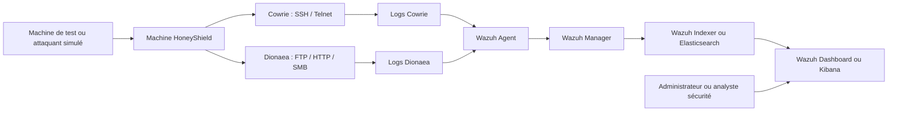
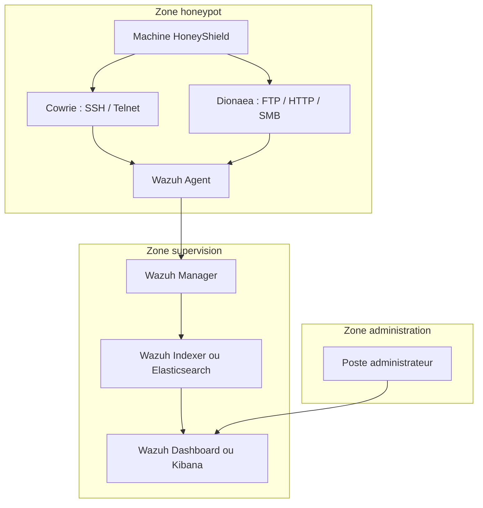

# HoneyShield : Conception et déploiement d’un environnement honeypot pour la détection et l’analyse des cyberattaques

## <mark style="background:#ff4d4f">1. Présentation générale du projet</mark>

### 1.1 Présentation de HoneyShield

HoneyShield est un projet de cybersécurité qui consiste à concevoir et déployer un environnement honeypot destiné à la détection et à l’analyse des activités malveillantes. Un honeypot est un système volontairement exposé ou simulé afin d’attirer les attaquants dans un cadre contrôlé.

L’objectif de HoneyShield n’est pas de protéger directement un système de production, mais de créer un environnement d’observation permettant de capturer les comportements suspects. Lorsqu’un attaquant interagit avec les services exposés, ses actions sont enregistrées afin d’être étudiées par la suite.

Ce projet permet ainsi de mieux comprendre les méthodes utilisées par les attaquants, les services les plus ciblés, les types de tentatives d’intrusion et les traces laissées lors d’une attaque. HoneyShield transforme donc une tentative d’intrusion en source d’information utile pour renforcer la sécurité d’un système d’information.

### 1.2 Domaine du projet

Le projet HoneyShield s’inscrit dans le domaine de la cybersécurité, plus précisément dans les domaines de la détection d’intrusion, de la surveillance réseau, de l’analyse des menaces et de la supervision de sécurité.

Aujourd’hui, les organisations sont confrontées à des attaques de plus en plus fréquentes, automatisées et difficiles à détecter. Les solutions classiques comme les pare-feu, les antivirus ou les mécanismes de contrôle d’accès restent importantes, mais elles ne suffisent pas toujours à comprendre le comportement des attaquants.

HoneyShield vient compléter ces mécanismes de défense en permettant d’observer les tentatives d’attaque dans un environnement séparé du système réel. Le projet touche donc plusieurs aspects importants de la cybersécurité :

- la sécurité des réseaux informatiques ;
- la détection des comportements suspects ;
- l’analyse des cyberattaques ;
- la collecte et l’exploitation des journaux d’activité ;
- la supervision des événements de sécurité ;
- l’aide à la réponse aux incidents.

### 1.3 Environnement cible

L’environnement cible de HoneyShield est un réseau informatique contrôlé dans lequel des services exposés peuvent être surveillés afin de détecter des tentatives d’intrusion. Cet environnement peut être mis en place dans un laboratoire, une infrastructure de test, un réseau universitaire ou un environnement d’entreprise dédié à l’expérimentation.

Pour limiter les risques, le honeypot doit être isolé des systèmes réels. Cette séparation est essentielle, car le rôle du honeypot est justement d’attirer des activités suspectes. Il ne doit donc pas permettre à un attaquant d’accéder aux ressources sensibles de l’organisation.

L’environnement HoneyShield peut comprendre :

- une machine honeypot destinée à simuler des services vulnérables ;
- un réseau de test isolé ;
- des services exposés comme SSH, FTP ou HTTP ;
- un système de collecte des logs ;
- un poste d’analyse pour consulter et interpréter les données collectées.

Cette architecture permet d’étudier les attaques dans un cadre sécurisé, sans compromettre le système d’information principal.

### 1.4 Résumé de la solution proposée

La solution HoneyShield repose sur la mise en place d’un honeypot capable d’attirer des attaquants, d’enregistrer leurs interactions et de fournir des données exploitables pour l’analyse de la menace.

Lorsqu’une tentative d’accès ou d’exploitation est détectée, le système collecte plusieurs informations : l’adresse IP source, la date et l’heure de l’événement, le service ciblé, les identifiants utilisés, les commandes exécutées ou encore les fichiers éventuellement déposés.

Ces données sont ensuite centralisées et analysées afin d’identifier les comportements suspects, les attaques récurrentes et les méthodes employées. Grâce à cette approche, HoneyShield permet d’améliorer la compréhension des cybermenaces et de proposer des mesures de sécurité adaptées.

En résumé, HoneyShield constitue une solution proactive. Au lieu d’attendre qu’une attaque touche directement un système sensible, il crée un espace contrôlé permettant d’observer les menaces avant qu’elles ne provoquent des dommages réels.

## <mark style="background:#ff4d4f">2. Contexte et justification du projet</mark>

### 2.1 Contexte général de la cybersécurité

Le développement des technologies numériques a profondément transformé le fonctionnement des organisations. Les entreprises, les administrations, les établissements d’enseignement, les banques et les hôpitaux utilisent quotidiennement des systèmes informatiques pour gérer leurs activités, stocker des données et fournir des services.

Cette dépendance au numérique rend les systèmes d’information indispensables, mais elle les expose également à de nombreux risques. Les données, les serveurs, les applications et les réseaux sont devenus des cibles importantes pour les cyberattaquants.

La cybersécurité occupe donc une place essentielle. Elle vise à protéger les infrastructures informatiques contre les accès non autorisés, les pertes de données, les interruptions de service et les intrusions.

Cependant, la protection seule ne suffit plus. Les attaquants cherchent constamment à exploiter les failles, les erreurs de configuration ou les mots de passe faibles. Il devient donc nécessaire d’ajouter des mécanismes de surveillance, de détection et d’analyse afin d’identifier rapidement les comportements suspects.

### 2.2 Menaces actuelles sur les systèmes exposés

Les systèmes accessibles sur un réseau ou sur Internet sont particulièrement exposés aux attaques. Dès qu’un service est ouvert à distance, il peut être ciblé par des attaquants humains ou par des outils automatisés.

Les menaces les plus fréquentes sont les scans de ports, les tentatives de connexion par force brute, les attaques contre les services SSH, FTP ou HTTP, l’exploitation de vulnérabilités connues, les dépôts de fichiers suspects ou encore les tentatives d’élévation de privilèges.

Ces actions peuvent sembler isolées, mais elles représentent souvent les premières étapes d’une attaque plus avancée. Un simple scan réseau peut annoncer une tentative d’exploitation. Une série d’échecs de connexion peut révéler une attaque par dictionnaire.

Le principal danger est que ces signaux passent inaperçus lorsqu’ils ne sont pas correctement surveillés. Un système exposé sans outil de détection efficace risque de découvrir l’attaque trop tard, parfois après la compromission.

### 2.3 Importance de la détection précoce des attaques

La détection précoce est un élément essentiel de la cybersécurité moderne. Elle permet d’identifier les comportements suspects avant qu’ils n’entraînent des conséquences graves.

Lorsqu’une attaque est détectée rapidement, l’administrateur peut réagir plus efficacement : bloquer une adresse IP, isoler une machine, corriger une faille, renforcer une règle de sécurité ou analyser les journaux d’activité.

À l’inverse, une détection tardive donne plus de temps à l’attaquant pour explorer le réseau, voler des informations, installer des outils malveillants ou créer des accès persistants.

Dans le cadre de HoneyShield, la détection précoce est au cœur du projet. Le honeypot permet d’observer les premières traces d’une attaque, de collecter les informations nécessaires et de mieux comprendre les intentions de l’attaquant.

### 2.4 Justification du choix d’un honeypot

Le choix d’un honeypot se justifie par le besoin d’observer les attaques dans un environnement sécurisé et séparé des systèmes réels.

Contrairement à certaines solutions de sécurité qui se limitent à bloquer ou signaler une menace, le honeypot permet d’étudier les actions de l’attaquant. Il simule un système attractif afin d’inciter l’attaquant à interagir avec lui, tout en enregistrant ses activités.

Dans le projet HoneyShield, le honeypot joue donc plusieurs rôles. Il sert d’outil de détection, de plateforme d’observation et de support d’analyse. Il permet de recueillir des informations sur les adresses IP suspectes, les services ciblés, les identifiants testés, les commandes exécutées et les méthodes d’attaque utilisées.

Ce choix est également pertinent dans un cadre pédagogique, car il permet de reproduire des situations proches de la réalité tout en limitant les risques. Les attaques peuvent ainsi être observées, comprises et analysées dans un environnement contrôlé.

## <mark style="background:#ff4d4f">3. Problématique</mark>

La protection des systèmes informatiques ne repose pas uniquement sur la mise en place de barrières de sécurité. Elle nécessite aussi une capacité à observer et comprendre les comportements malveillants.

Dans de nombreuses infrastructures, les attaques ne sont détectées qu’après l’apparition de conséquences visibles : compromission d’un compte, vol de données, modification de fichiers, ralentissement d’un service ou indisponibilité d’une application. Cette détection tardive limite la capacité des administrateurs à comprendre l’origine de l’attaque et les actions réellement effectuées.

Face à cette situation, le projet HoneyShield cherche à répondre à la problématique suivante :

**Comment concevoir et déployer un environnement honeypot capable d’attirer, de détecter et d’analyser des tentatives de cyberattaques dans un cadre contrôlé, sans mettre en danger les systèmes réels ?**

### 3.1 Problème principal identifié

Le problème principal est la difficulté à détecter et analyser rapidement les comportements malveillants visant les systèmes exposés.

Lorsqu’un service est accessible sur un réseau, il peut être ciblé par des scans, des tentatives de connexion ou des attaques automatisées. Ces événements peuvent passer inaperçus si les journaux ne sont pas centralisés, surveillés ou correctement interprétés.

Les systèmes réels ne doivent pas servir directement de terrain d’observation, car cela pourrait mettre en danger l’organisation. Il est donc nécessaire de disposer d’un environnement sécurisé, isolé et contrôlé, capable de capter les tentatives d’attaque sans exposer les ressources critiques.

### 3.2 Questions techniques du projet

Pour répondre à cette problématique, plusieurs questions techniques se posent :

- Comment concevoir une architecture honeypot isolée et sécurisée ?
- Quels services exposer pour attirer les comportements suspects ?
- Comment collecter les journaux générés par les interactions avec le honeypot ?
- Comment centraliser les données issues des différents composants ?
- Comment analyser les traces afin d’identifier les comportements malveillants ?
- Comment visualiser les événements de sécurité dans un tableau de bord clair ?
- Comment vérifier que HoneyShield détecte correctement les scans, les connexions suspectes et les tentatives d’attaque ?

Ces questions orientent la conception, la mise en œuvre et l’évaluation du projet.

### 3.3 Hypothèse de solution proposée

L’hypothèse retenue est qu’un environnement honeypot bien conçu, isolé du système réel et associé à une solution de supervision, peut permettre de détecter et d’analyser efficacement des comportements malveillants.

Dans cette approche, HoneyShield servira de leurre contrôlé. Il exposera certains services afin d’attirer les tentatives d’attaque, tout en enregistrant les actions effectuées par les attaquants ou les outils automatisés.

L’utilisation d’outils comme Cowrie, Dionaea et Wazuh permettra de couvrir plusieurs besoins. Cowrie pourra observer les tentatives de connexion SSH, Dionaea pourra détecter certaines interactions avec des services exposés, tandis que Wazuh permettra de centraliser et visualiser les événements de sécurité.

Cette hypothèse sera vérifiée à travers la mise en place de l’environnement, la simulation contrôlée de certaines attaques et l’analyse des résultats obtenus.

## <mark style="background:#ff4d4f">4. Objectifs du projet</mark>

Les objectifs du projet HoneyShield permettent de définir clairement les résultats attendus. Ils concernent à la fois la conception de l’environnement, le déploiement des outils, la collecte des données et l’analyse des attaques observées.

HoneyShield ne se limite pas à l’installation d’un honeypot. Il s’agit de mettre en place une solution complète permettant de surveiller les interactions suspectes, de centraliser les journaux et d’exploiter les données collectées.

### 4.1 Objectif général

L’objectif général du projet HoneyShield est de concevoir et déployer un environnement honeypot sécurisé, isolé et supervisé, capable de détecter, collecter et analyser des tentatives de cyberattaques dans un cadre contrôlé.

Cet objectif vise à démontrer l’intérêt d’un honeypot dans une stratégie de cybersécurité proactive. Le projet doit permettre d’observer les comportements malveillants sans exposer les systèmes réels, tout en produisant des informations utiles pour améliorer la sécurité.

---

### 4.2 Objectifs spécifiques

Pour atteindre cet objectif général, le projet poursuit les objectifs spécifiques suivants :

- mettre en place une architecture honeypot isolée ;
- déployer des services exposés afin d’attirer des comportements suspects ;
- installer et configurer des outils honeypot comme Cowrie et Dionaea ;
- centraliser les journaux et les événements de sécurité ;
- intégrer une solution de supervision comme Wazuh ;
- réaliser des simulations contrôlées d’attaques ;
- analyser les données collectées ;
- identifier les adresses IP suspectes, les ports ciblés, les identifiants testés et les commandes exécutées ;
- évaluer l’apport de HoneyShield dans la détection des attaques ;
- proposer des pistes d’amélioration pour faire évoluer la solution.

Ces objectifs permettent de structurer le projet depuis la conception jusqu’à l’évaluation finale.

## <mark style="background:#ff4d4f">5. Intérêt du projet</mark>

Le projet HoneyShield présente un intérêt important, car il permet de relier les notions théoriques de cybersécurité à une mise en pratique concrète.

Il permet non seulement de comprendre le fonctionnement d’un honeypot, mais aussi d’observer des comportements suspects, de collecter des données et d’analyser les événements générés. Son intérêt se situe à plusieurs niveaux : pédagogique, technique, sécuritaire et organisationnel.

### 5.1 Intérêt pédagogique

Sur le plan pédagogique, HoneyShield constitue un support d’apprentissage concret pour comprendre les cyberattaques et les mécanismes de détection.

Grâce à ce projet, il devient possible d’observer les différentes étapes d’une attaque, depuis la reconnaissance jusqu’aux tentatives d’accès non autorisé. Les apprenants peuvent également analyser les traces laissées dans les journaux et comprendre comment ces informations peuvent être utilisées pour détecter une menace.

HoneyShield favorise donc l’apprentissage par la pratique. Il permet d’installer des outils, de configurer des services, de générer des événements, de consulter les logs et d’interpréter les alertes.

Ce projet transforme ainsi des notions parfois théoriques en expériences concrètes et observables.

### 5.2 Intérêt technique

Sur le plan technique, HoneyShield mobilise plusieurs compétences importantes dans le domaine de l’informatique et de la cybersécurité.

La mise en œuvre du projet nécessite des connaissances en administration Linux, en configuration réseau, en virtualisation, en gestion des services, en collecte des logs et en supervision.

Le projet permet notamment de travailler sur :

- l’installation et l’administration d’un serveur Linux ;
- la configuration d’un réseau isolé ;
- le déploiement d’outils honeypot ;
- la centralisation des journaux d’activité ;
- l’intégration d’une solution de supervision ;
- la visualisation des événements de sécurité ;
- la vérification du bon fonctionnement de l’architecture.

L’intérêt technique de HoneyShield réside donc dans sa dimension complète. Il ne s’agit pas seulement d’installer un outil, mais de concevoir une solution cohérente et fonctionnelle.

### 5.3 Intérêt en cybersécurité

En cybersécurité, HoneyShield permet d’améliorer la détection et l’analyse des comportements malveillants.

Le honeypot collecte des informations utiles sur les attaques : adresses IP, ports ciblés, identifiants utilisés, mots de passe testés, commandes exécutées ou comportements automatisés.

Ces données permettent de mieux comprendre les méthodes employées par les attaquants. Elles peuvent également aider à renforcer les règles de détection, améliorer les configurations de sécurité et préparer une meilleure réponse aux incidents.

HoneyShield contribue ainsi à passer d’une sécurité uniquement défensive à une approche plus active, basée sur l’observation, l’analyse et l’anticipation des menaces.

### 5.4 Intérêt pour une organisation

Pour une organisation, HoneyShield peut constituer un outil complémentaire dans une stratégie globale de cybersécurité.

Les entreprises, les universités, les administrations ou les structures disposant de services numériques sont régulièrement exposées à des tentatives d’intrusion. Même lorsqu’elles ne sont pas des cibles prioritaires, elles peuvent être visées par des attaques automatisées.

HoneyShield permet de surveiller ces comportements dans un environnement isolé. Les informations collectées peuvent aider les responsables informatiques à mieux comprendre les menaces, adapter les règles de sécurité, renforcer la supervision et sensibiliser les utilisateurs.

Le projet peut également servir de base pour une évolution vers des dispositifs plus avancés, comme l’intégration avec un SOC, un SIEM, des alertes automatiques ou des mécanismes d’analyse intelligente.

Ainsi, HoneyShield présente un intérêt stratégique, opérationnel et pédagogique pour toute organisation souhaitant renforcer sa capacité de détection et d’analyse des cybermenaces.

---
# <mark style="background:rgba(205, 244, 105, 0.55)">Partie I : Cadre théorique</mark>

## <mark style="background:#ff4d4f">6. Généralités sur les honeypots</mark>

### 6.1 Définition d’un honeypot

Un honeypot est un système informatique volontairement conçu pour attirer les attaquants dans un environnement contrôlé. Il peut prendre la forme d’un serveur, d’un service réseau, d’une application ou d’une machine simulée qui donne l’apparence d’une cible réelle ou vulnérable.

Le principe du honeypot repose sur une idée simple : au lieu d’attendre qu’un attaquant cible directement un système sensible, on met en place un environnement leurre destiné à capter son attention. Lorsqu’un attaquant interagit avec ce système, ses actions sont enregistrées afin d’être analysées.

Un honeypot ne sert donc pas principalement à fournir un service normal aux utilisateurs. Sa fonction principale est d’observer les comportements suspects. Toute interaction avec le honeypot est généralement considérée comme anormale, car ce système n’est pas censé être utilisé par des utilisateurs légitimes.

Dans le cadre de la cybersécurité, un honeypot permet de collecter plusieurs types d’informations : les adresses IP sources, les ports ciblés, les identifiants testés, les mots de passe utilisés, les commandes exécutées, les fichiers déposés ou encore les méthodes employées par les attaquants.

Ainsi, un honeypot peut être défini comme un outil de leurre, de détection et d’analyse permettant d’étudier les cyberattaques dans un cadre sécurisé.

### 6.2 Rôle d’un honeypot en cybersécurité

Le rôle principal d’un honeypot est d’aider à détecter et comprendre les activités malveillantes. Il permet de repérer des tentatives d’intrusion qui pourraient passer inaperçues dans un système classique.

En cybersécurité, les attaquants commencent souvent par rechercher des services accessibles, tester des mots de passe faibles, scanner des ports ou exploiter des failles connues. Un honeypot permet de capter ces premières actions et de les transformer en données exploitables.

Le honeypot joue donc plusieurs rôles importants.

Il sert d’abord d’outil de détection. Lorsqu’une connexion est établie avec le honeypot, cela peut indiquer une activité suspecte. Cette interaction peut révéler qu’un attaquant ou un outil automatisé explore le réseau.

Il joue ensuite un rôle d’observation. Le honeypot permet de suivre les actions réalisées par l’attaquant : tentatives de connexion, commandes saisies, fichiers téléchargés, services ciblés ou comportements automatisés.

Il joue également un rôle d’analyse. Les informations collectées permettent de mieux comprendre les techniques utilisées par les attaquants. Ces données peuvent ensuite aider à renforcer les règles de sécurité, améliorer la supervision ou préparer une réponse aux incidents.

Enfin, le honeypot peut avoir un rôle pédagogique. Il permet aux étudiants, administrateurs et analystes de cybersécurité d’observer concrètement des attaques dans un environnement contrôlé, sans exposer directement les systèmes réels.

### 6.3 Fonctionnement général d’un honeypot

Le fonctionnement général d’un honeypot repose sur la mise en place d’un environnement qui imite un système réel ou vulnérable. Cet environnement est volontairement exposé afin d’attirer des interactions suspectes.

Dans un premier temps, le honeypot est installé sur une machine physique ou virtuelle. Il est ensuite configuré pour simuler certains services réseau, par exemple SSH, FTP, HTTP ou d’autres services fréquemment ciblés par les attaquants.

Dans un deuxième temps, le honeypot est placé dans un environnement contrôlé. Il doit être séparé des systèmes sensibles afin d’éviter qu’un attaquant puisse l’utiliser comme point d’entrée vers le réseau réel. Cette isolation est une règle essentielle dans la mise en place d’un honeypot.

Lorsqu’un attaquant tente d’interagir avec le honeypot, le système enregistre ses actions. Il peut collecter l’adresse IP de l’attaquant, l’heure de la connexion, le service ciblé, les identifiants utilisés, les mots de passe testés, les commandes exécutées ou les fichiers déposés.

Dans un troisième temps, les données collectées sont analysées. Cette analyse peut être réalisée directement dans les journaux du honeypot ou à travers une solution de supervision comme Wazuh, Kibana ou un autre outil SIEM.

Le fonctionnement d’un honeypot peut donc être résumé en quatre étapes :

- **Exposer** un service ou un système leurre.
- **Attirer** les tentatives d’interaction suspectes.
- **Collecter** les traces laissées par les attaquants.
- **Analyser** les informations obtenues pour mieux comprendre les menaces.

Dans le cadre de HoneyShield, ce fonctionnement sera appliqué à travers des outils comme Cowrie, Dionaea et Wazuh, afin de détecter, centraliser et analyser les événements générés par les interactions suspectes.

### 6.4 Types de honeypots

Il existe plusieurs types de honeypots. Ils peuvent être classés selon leur niveau d’interaction, leur objectif ou leur domaine d’utilisation.

Selon le niveau d’interaction, on distingue principalement les honeypots à faible interaction, les honeypots à moyenne interaction et les honeypots à forte interaction.

Un honeypot à faible interaction simule simplement certains services ou certaines réponses réseau. Il ne donne pas réellement accès à un système complet. Son objectif est surtout de détecter des scans, des connexions suspectes ou des tentatives simples d’exploitation. Ce type de honeypot est plus facile à installer et présente moins de risques, mais il fournit moins de détails sur les actions de l’attaquant.
![[Pasted image 20260529000306.png]]

Un honeypot à moyenne interaction offre davantage de possibilités d’interaction. Il peut simuler un service de manière plus réaliste et collecter plus d’informations sur le comportement de l’attaquant. Il représente un bon équilibre entre richesse des données collectées et maîtrise des risques.

![[Pasted image 20260529000801.png]]

Un honeypot à forte interaction fournit un environnement beaucoup plus proche d’un vrai système. L’attaquant peut interagir avec plusieurs services et réaliser davantage d’actions. Ce type de honeypot permet de collecter des informations très riches, mais il présente aussi plus de risques, car l’attaquant peut tenter d’utiliser l’environnement compromis pour mener d’autres actions malveillantes.

![[Pasted image 20260529001101.png]]

On peut aussi distinguer les honeypots selon leur objectif.

Un honeypot de recherche est utilisé pour étudier les comportements des attaquants, comprendre les nouvelles techniques d’attaque et collecter des données sur les menaces.

Un honeypot de production est utilisé dans une organisation pour détecter rapidement les activités suspectes dans un environnement réel ou proche du réel.

Il existe également des honeypots spécialisés. Certains sont conçus pour observer les attaques SSH, d’autres pour les malwares, les services web, les bases de données, les objets connectés ou les protocoles industriels.

Le choix du type de honeypot dépend donc du niveau de détail recherché, du niveau de risque accepté et des objectifs du projet.

Dans le cadre du projet HoneyShield, le type de honeypot mis en place correspond principalement à un honeypot à faible interaction, avec certains aspects proches d’un honeypot à moyenne interaction. En effet, l’objectif n’est pas de fournir un système complet à l’attaquant, mais de simuler des services exposés afin d’attirer des tentatives de connexion, des scans ou des attaques automatisées.

L’utilisation de Cowrie permet d’observer les tentatives de connexion SSH, les identifiants testés et certaines commandes saisies par l’attaquant. Dionaea permet quant à lui de capter des interactions avec des services vulnérables ou exposés. Ces outils permettent donc de collecter des informations utiles tout en limitant les risques liés à une compromission réelle.

HoneyShield ne peut donc pas être considéré comme un honeypot à forte interaction, car il ne donne pas accès à une infrastructure complète ou à un système réel. Il s’agit plutôt d’un environnement contrôlé, isolé et supervisé, destiné à détecter et analyser les comportements suspects.

### 6.5 Avantages des honeypots

Les honeypots présentent plusieurs avantages importants en cybersécurité.

Le premier avantage est la détection des activités suspectes. Comme un honeypot n’est normalement pas utilisé par des utilisateurs légitimes, toute interaction avec lui peut être considérée comme potentiellement malveillante. Cela facilite l’identification des comportements anormaux.

Le deuxième avantage est la collecte d’informations détaillées. Un honeypot permet d’enregistrer les actions réalisées par un attaquant : services ciblés, identifiants testés, mots de passe utilisés, commandes exécutées ou fichiers déposés. Ces informations peuvent être très utiles pour comprendre les méthodes d’attaque.

Le troisième avantage est l’amélioration de la connaissance des menaces. En observant les attaques, il devient possible d’identifier les tendances, les techniques les plus fréquentes et les comportements automatisés. Cette connaissance peut ensuite aider à renforcer les politiques de sécurité.

Le quatrième avantage est la réduction des faux positifs. Dans certains systèmes de détection classiques, de nombreuses alertes peuvent être générées par des activités normales. Dans le cas d’un honeypot, les interactions sont plus facilement considérées comme suspectes, car le système n’a pas vocation à être utilisé normalement.

Le cinquième avantage est l’intérêt pédagogique. Les honeypots permettent de créer un environnement d’apprentissage réaliste dans lequel les étudiants ou les professionnels peuvent observer des attaques et analyser les traces laissées par les attaquants.

Enfin, les honeypots peuvent contribuer à améliorer la réponse aux incidents. Les données collectées peuvent aider les équipes de sécurité à comprendre les comportements hostiles, à adapter les règles de détection et à renforcer les mécanismes de défense existants.

### 6.6 Limites et risques des honeypots

Malgré leurs avantages, les honeypots présentent aussi certaines limites et certains risques.

La première limite est qu’un honeypot ne remplace pas les autres solutions de sécurité. Il ne doit pas être considéré comme une protection complète. Il vient plutôt compléter les pare-feu, les antivirus, les systèmes de détection d’intrusion, les solutions de supervision et les bonnes pratiques de sécurité.

La deuxième limite concerne le périmètre de détection. Un honeypot ne détecte que les attaques ou les interactions qui le ciblent directement. Si un attaquant ne touche pas le honeypot, celui-ci ne pourra pas observer son comportement.

La troisième limite est liée à la configuration. Un honeypot mal configuré peut être facilement identifié par un attaquant expérimenté. Si le leurre n’est pas crédible, l’attaquant peut l’éviter ou modifier son comportement.

La quatrième limite concerne le risque de compromission. Si le honeypot est mal isolé, un attaquant peut tenter de l’utiliser comme point d’appui pour attaquer d’autres systèmes. C’est pourquoi l’isolation réseau, la limitation des accès et la surveillance permanente sont indispensables.

La cinquième limite concerne l’analyse des données. Un honeypot peut générer beaucoup de logs. Si ces données ne sont pas correctement organisées, centralisées et interprétées, elles peuvent devenir difficiles à exploiter.

Enfin, l’utilisation d’un honeypot doit respecter un cadre éthique et légal. Il ne doit pas servir à piéger abusivement des utilisateurs légitimes ni à mener des actions offensives contre des tiers. Son rôle doit rester limité à l’observation, à la détection et à l’analyse dans un environnement contrôlé.

Ainsi, les honeypots sont des outils puissants pour la cybersécurité, mais ils doivent être utilisés avec prudence. Leur efficacité dépend fortement de leur bonne configuration, de leur isolation et de leur intégration dans une stratégie globale de sécurité.

## <mark style="background:#ff4d4f">7. Cyberattaques ciblées par HoneyShield</mark>

Le projet HoneyShield vise à observer et analyser certaines attaques courantes qui ciblent les systèmes exposés sur un réseau. Ces attaques représentent souvent les premières étapes d’une tentative d’intrusion. Elles peuvent être réalisées manuellement par un attaquant ou automatiquement par des scripts, des scanners ou des bots.

Dans le cadre de ce projet, HoneyShield se concentre principalement sur les attaques qui peuvent être détectées à travers des services exposés, des journaux d’activité et des événements de sécurité. Les attaques ciblées concernent notamment le scan réseau, les attaques par force brute, les connexions SSH suspectes, l’exploitation de services exposés et les comportements automatisés.

L’objectif n’est pas de traiter toutes les formes de cyberattaques existantes, mais de se concentrer sur des scénarios réalistes, observables et exploitables dans un environnement honeypot contrôlé.

### 7.1 Scan réseau

Le scan réseau est l’une des premières étapes utilisées par un attaquant lorsqu’il cherche à identifier les machines et services accessibles dans une infrastructure. Cette phase permet de découvrir les adresses IP actives, les ports ouverts, les services disponibles et parfois les versions logicielles utilisées.

Un scan peut être réalisé à l’aide d’outils spécialisés comme Nmap. L’attaquant peut par exemple chercher à savoir si un serveur expose des services comme SSH, FTP, HTTP, SMB ou d’autres ports sensibles. Les informations obtenues pendant cette phase peuvent ensuite servir à préparer une attaque plus ciblée.

Le scan réseau peut sembler anodin, mais il constitue souvent une phase de reconnaissance importante. Lorsqu’un attaquant identifie un port ouvert, il peut tenter de déterminer si le service associé présente une vulnérabilité connue ou une mauvaise configuration.

Dans le cadre de HoneyShield, la détection des scans réseau est importante, car elle permet d’identifier les premières interactions suspectes avec l’environnement honeypot. Lorsqu’un outil de scan interroge les services exposés, les traces de cette activité peuvent être collectées et analysées.

HoneyShield pourra donc permettre d’observer :

- Les Adresses IP à l’origine du scan ;
- Les Ports ciblés par l’attaquant ;
- Les Services recherchés ;
- La Fréquence des requêtes ;
- Le Type de scan utilisé ;
- Les Tentatives de reconnaissance avant une attaque.

L’analyse de ces informations permet de mieux comprendre la phase de reconnaissance d’un attaquant et de déterminer quels services attirent le plus son attention.

### 7.2 Attaque par force brute

L’attaque par force brute est une technique qui consiste à tester un grand nombre de combinaisons d’identifiants et de mots de passe afin d’obtenir un accès non autorisé à un système. Elle est souvent utilisée contre des services d’authentification comme SSH, FTP, les interfaces web d’administration ou les services distants.

Dans une attaque par force brute, l’attaquant peut utiliser une liste de noms d’utilisateurs et de mots de passe courants. Il peut également utiliser des dictionnaires contenant des mots de passe faibles ou fréquemment utilisés. L’objectif est de trouver une combinaison valide permettant d’accéder au système.

Ce type d’attaque est particulièrement dangereux lorsque les utilisateurs choisissent des mots de passe simples, réutilisés ou faciles à deviner. Des identifiants comme `admin`, `root`, `test`, `user` ou des mots de passe comme `123456`, `password`, `admin123` sont souvent testés dans ce type d’attaque.

Dans le cadre de HoneyShield, l’attaque par force brute est importante à observer, car elle permet de collecter des informations utiles sur les identifiants et mots de passe testés par les attaquants. Ces informations peuvent aider à mieux comprendre les habitudes des attaquants et à renforcer les politiques de mot de passe.

HoneyShield pourra permettre d’analyser :

- Les Noms d’utilisateurs testés ;
- Les Mots de passe utilisés ;
- Le Nombre de tentatives de connexion ;
- La Durée de l’attaque ;
- L’Adresse IP de l’attaquant ;
- Le Service ciblé ;
- Le Moment où l’attaque est réalisée.

Grâce à cette observation, il devient possible d’identifier les attaques répétitives, les dictionnaires utilisés et les comportements automatisés liés aux tentatives d’accès non autorisé.

### 7.3 Connexion SSH suspecte

Le protocole SSH est utilisé pour administrer à distance des machines Linux ou des serveurs. Il permet à un administrateur de se connecter de manière sécurisée à un système afin d’exécuter des commandes, modifier des fichiers ou gérer des services.

Cependant, SSH est aussi l’un des services les plus ciblés par les attaquants lorsqu’il est exposé sur un réseau ou sur Internet. Les attaques contre SSH peuvent prendre plusieurs formes : tentatives de connexion avec des identifiants faibles, attaques par dictionnaire, tests de comptes par défaut, ou encore tentatives d’exécution de commandes après une authentification réussie.

Une connexion SSH devient suspecte lorsqu’elle provient d’une adresse IP inconnue, lorsqu’elle utilise des identifiants inhabituels, lorsqu’elle génère un nombre élevé d’échecs ou lorsqu’elle tente d’exécuter des commandes anormales.

Dans le cadre du projet HoneyShield, l’observation des connexions SSH suspectes est particulièrement importante. L’outil Cowrie peut être utilisé pour simuler un service SSH et enregistrer les interactions effectuées par l’attaquant. Il permet notamment de capturer les identifiants testés, les commandes saisies et certains fichiers éventuellement téléchargés.

HoneyShield pourra ainsi observer :

- Les Tentatives de connexion SSH ;
- Les Identifiants utilisés ;
- Les Mots de passe testés ;
- Les Commandes exécutées après connexion ;
- Les Tentatives de téléchargement de fichiers ;
- Les Adresses IP sources ;
- Les Horaires des connexions suspectes.

Cette analyse permet de mieux comprendre comment les attaquants ciblent les services SSH et quelles actions ils tentent de réaliser lorsqu’ils pensent avoir compromis un système.

### 7.4 Exploitation de services exposés

Un service exposé est un service accessible depuis un réseau. Il peut s’agir d’un service web, SSH, FTP, Telnet, SMB, d’une base de données ou d’une interface d’administration. Lorsqu’un service est exposé, il devient une cible potentielle pour les attaquants.

L’exploitation de services exposés consiste à profiter d’une vulnérabilité, d’une mauvaise configuration ou d’un accès faible pour compromettre le service. Par exemple, un attaquant peut tenter d’exploiter une version ancienne d’un logiciel, une faille connue, un mot de passe par défaut ou une interface mal protégée.

Ce type d’attaque est dangereux, car il peut permettre à l’attaquant d’obtenir un accès non autorisé, d’exécuter du code, de déposer des fichiers malveillants ou de prendre le contrôle partiel d’un système.

Dans le cadre de HoneyShield, l’exploitation de services exposés permet d’observer les techniques utilisées par les attaquants lorsqu’ils identifient un service intéressant. Les outils honeypot peuvent simuler certains services afin de collecter les interactions suspectes.

HoneyShield pourra permettre d’observer :

- Les Services les plus ciblés ;
- Les Ports attaqués ;
- Les Tentatives d’exploitation ;
- Les Requêtes suspectes ;
- Les Fichiers déposés ou téléchargés ;
- Les Signatures d’attaque ;
- Les Comportements après interaction avec le service.

L’analyse de ces éléments permet de mieux comprendre les risques liés aux services exposés et d’identifier les mesures nécessaires pour réduire la surface d’attaque.

### 7.5 Comportements automatisés ou attaques par bots

De nombreuses attaques informatiques ne sont pas réalisées directement par un humain, mais par des programmes automatisés. Ces programmes, appelés bots, peuvent scanner de grandes plages d’adresses IP, rechercher des services ouverts, tester des mots de passe ou exploiter automatiquement certaines vulnérabilités.

Les attaques automatisées sont fréquentes, car elles permettent aux attaquants de cibler un grand nombre de systèmes en peu de temps. Un bot peut par exemple rechercher des serveurs SSH mal protégés, tester des milliers de combinaisons d’identifiants ou tenter d’installer un logiciel malveillant après une connexion réussie.

Les comportements automatisés se reconnaissent souvent par leur répétition, leur rapidité et leur régularité. Ils peuvent générer un grand nombre de requêtes en peu de temps, utiliser les mêmes identifiants sur plusieurs systèmes ou suivre des séquences d’actions très similaires.

Dans le cadre de HoneyShield, l’observation des comportements automatisés est importante, car elle permet de différencier certaines attaques humaines de certaines attaques réalisées par des scripts. Les logs collectés peuvent révéler des modèles récurrents, comme des tentatives répétées sur les mêmes ports ou l’utilisation fréquente de certains mots de passe.

HoneyShield pourra permettre d’analyser :

- Les Tentatives répétitives provenant d’une même adresse IP ;
- Les Scans rapides de plusieurs ports ;
- Les Connexions échouées en grand nombre ;
- Les Identifiants testés automatiquement ;
- Les Séquences de commandes répétées ;
- Les Comportements similaires entre plusieurs attaques ;
- Les Traces laissées par des scripts ou des outils automatisés.

L’étude de ces comportements permet de mieux comprendre la menace représentée par les bots et d’améliorer les mécanismes de détection. Elle permet aussi de montrer que même un système peu connu peut être rapidement ciblé lorsqu’il est exposé sur un réseau.

<mark style="background:#b1ffff">Dans le cadre de HoneyShield, les services exposés par le honeypot seront principalement SSH, Telnet, FTP, HTTP et SMB. Ces services seront simulés afin d’attirer les tentatives d’attaque, collecter les traces laissées par les attaquants et permettre leur analyse à travers les journaux et la supervision Wazuh.</mark>

---

# Partie II : Conception de la solution HoneyShield

## 8. Conception technique de la solution HoneyShield

La conception technique de HoneyShield présente l’organisation retenue pour mettre en place l’environnement honeypot. Cette partie décrit l’architecture de la solution, les zones réseau, les services exposés, les composants utilisés, les flux de fonctionnement ainsi que les mesures de sécurité prévues.

Contrairement à la partie théorique, cette partie ne cherche plus à définir les honeypots de manière générale. Elle présente plutôt les choix techniques retenus pour le projet HoneyShield et explique comment les différents éléments doivent fonctionner ensemble.

L’objectif est de concevoir une solution simple, contrôlée et exploitable, capable d’exposer des services leurres, de collecter les journaux générés par les interactions suspectes et de transmettre ces informations vers une plateforme de supervision.

### 8.1 Principe de conception retenu

Le principe de conception retenu pour HoneyShield repose sur la mise en place d’un honeypot à faible interaction, avec certains comportements proches d’un honeypot à moyenne interaction.

Ce choix s’explique par la volonté de simuler des services exposés sans donner à l’attaquant un accès complet à un système réel. L’environnement proposé ne doit donc pas permettre une compromission profonde de l’infrastructure. Il doit plutôt offrir une surface d’interaction suffisante pour observer les tentatives de connexion, les scans, les identifiants testés et certaines commandes exécutées.

La conception de HoneyShield repose sur quatre principes essentiels :

- **Exposer** des services leurres afin d’attirer les interactions suspectes ;
    
- **Isoler** la machine honeypot du réseau réel ;
    
- **Collecter** les journaux générés par les outils honeypot ;
    
- **Centraliser et visualiser** les événements à travers une solution de supervision.
    

Dans cette architecture, le honeypot ne joue pas le rôle d’un serveur de production. Il constitue un environnement contrôlé destiné à recevoir des interactions non légitimes. Les services exposés sont donc volontairement simulés pour observer les comportements des attaquants ou des outils automatisés.

Le choix de cette conception permet de limiter les risques tout en conservant une bonne capacité d’analyse. HoneyShield pourra ainsi détecter des scans réseau, des tentatives de connexion SSH, des attaques par force brute, des interactions avec des services exposés et des comportements automatisés.

### 8.2 Architecture générale de HoneyShield

L’architecture générale de HoneyShield est organisée autour de trois blocs principaux : le bloc honeypot, le bloc supervision et le bloc administration.

Le bloc honeypot représente la zone exposée du projet. Il contient la machine HoneyShield sur laquelle sont installés les outils destinés à simuler les services réseau. Cette machine reçoit les connexions provenant d’une machine de test ou d’une source externe contrôlée.

Le bloc supervision représente la zone chargée de recevoir, traiter et stocker les événements générés par le honeypot. Il comprend principalement Wazuh Manager, Wazuh Indexer ou Elasticsearch, ainsi que Wazuh Dashboard ou Kibana.

Le bloc administration représente l’espace réservé à l’administrateur ou à l’analyste sécurité. Il permet de consulter les alertes, d’analyser les journaux et d’interpréter les résultats observés.

L’architecture globale de HoneyShield peut être présentée comme suit :

|Bloc|Composants principaux|Rôle|
|---|---|---|
|Bloc honeypot|Linux, Cowrie, Dionaea, Wazuh Agent|Exposition des services leurres et génération des journaux|
|Bloc supervision|Wazuh Manager, Wazuh Indexer ou Elasticsearch|Centralisation, analyse et stockage des événements|
|Bloc visualisation|Wazuh Dashboard ou Kibana|Consultation des alertes et des événements|
|Bloc administration|Poste administrateur ou analyste sécurité|Analyse et interprétation des résultats|
|Bloc test|Kali Linux ou poste de test|Simulation contrôlée des attaques|

Cette organisation permet de séparer clairement les fonctions de chaque composant. Le honeypot reçoit les interactions, les outils spécialisés enregistrent les événements, Wazuh centralise les journaux et le tableau de bord permet leur exploitation.

La séparation de ces blocs est importante, car elle évite de concentrer toutes les fonctions sur une seule machine exposée. Même si la machine honeypot est ciblée, les composants de supervision et d’administration restent placés dans une zone plus protégée.

### 8.3 Organisation réseau et zones de sécurité

L’organisation réseau de HoneyShield doit permettre d’exposer le honeypot tout en limitant les risques pour les autres machines. La machine HoneyShield doit donc être installée dans une zone isolée ou dans un réseau de test séparé du réseau réel.

L’architecture peut être organisée en trois zones principales :

|Zone|Description|Niveau d’exposition|
|---|---|---|
|Zone honeypot|Contient la machine HoneyShield et les services simulés|Exposée aux tests|
|Zone supervision|Contient Wazuh Manager, l’indexeur et le tableau de bord|Protégée|
|Zone administration|Contient le poste de l’administrateur ou de l’analyste|Accès réservé|

La zone honeypot est la seule zone qui reçoit directement les interactions suspectes. Elle peut être placée dans un réseau de laboratoire, une DMZ, un VLAN dédié ou un segment réseau isolé. Elle doit être accessible pour les tests, mais elle ne doit pas avoir d’accès libre vers les systèmes internes.

La zone supervision doit rester protégée. Elle reçoit les journaux provenant du honeypot, mais elle ne doit pas être directement exposée aux attaquants. Cette zone contient les éléments sensibles de collecte, d’analyse et de stockage des événements.

La zone administration permet à l’analyste de consulter les résultats. L’accès à cette zone doit être limité aux personnes autorisées. Il est préférable que le tableau de bord soit accessible uniquement depuis un poste d’administration ou depuis un réseau de gestion sécurisé.

Les flux réseau doivent être strictement contrôlés. Les connexions entrantes doivent être autorisées uniquement vers les services simulés du honeypot. Les flux sortants du honeypot doivent être limités afin d’éviter qu’il soit utilisé comme point de rebond.

Les principaux flux prévus sont les suivants :

|Source|Destination|Flux autorisé|Objectif|
|---|---|---|---|
|Machine de test|Honeypot|SSH, Telnet, FTP, HTTP, SMB|Simulation des attaques|
|Honeypot|Wazuh Manager|Transmission des logs|Centralisation des événements|
|Administrateur|Tableau de bord|HTTPS|Consultation des alertes|
|Honeypot|Réseau réel|Bloqué ou strictement limité|Réduction du risque de rebond|

Cette organisation réseau permet de conserver une architecture maîtrisée. Le honeypot reste visible pour les tests, tandis que la supervision et l’administration restent protégées.

### 8.4 Services exposés par le honeypot

La machine HoneyShield expose plusieurs services leurres afin de couvrir différents scénarios d’attaque. Ces services ne sont pas destinés à fournir une fonction réelle à des utilisateurs légitimes. Ils servent uniquement à recevoir des interactions suspectes et à produire des journaux exploitables.

Les services retenus sont SSH, Telnet, FTP, HTTP et SMB. Ce choix permet de couvrir les attaques les plus courantes contre les systèmes exposés.

|Service exposé|Port courant|Outil utilisé|Rôle dans HoneyShield|
|---|--:|---|---|
|SSH|22|Cowrie|Observer les tentatives de connexion distante et les attaques par force brute|
|Telnet|23|Cowrie|Observer les connexions faibles, anciennes ou automatisées|
|FTP|21|Dionaea|Observer les tentatives d’accès à un service de fichiers|
|HTTP|80|Dionaea ou service web leurre|Observer les requêtes web suspectes|
|SMB|445|Dionaea|Observer les scans et interactions visant les partages réseau|

Le service SSH est particulièrement important, car il fait partie des services les plus ciblés lorsqu’un serveur Linux est exposé. Il permet d’observer les attaques par dictionnaire, les tentatives d’accès avec des comptes par défaut et les commandes exécutées après une connexion simulée.

Le service Telnet est également intéressant, car il est ancien et peu sécurisé. Il est souvent ciblé par des bots ou des attaques automatisées, notamment dans des contextes liés aux équipements réseau et aux objets connectés.

Le service FTP permet d’observer les tentatives d’accès à un service de transfert de fichiers. Il peut révéler des essais de connexion anonyme, des tests d’identifiants faibles ou des tentatives de dépôt de fichiers suspects.

Le service HTTP permet d’observer les requêtes web suspectes. Il peut s’agir de recherches de pages d’administration, de scans de répertoires, de requêtes automatisées ou de tentatives d’exploitation de failles web connues.

Le service SMB permet d’observer des interactions liées au partage de fichiers. Ce service est souvent ciblé dans les attaques réseau, notamment lorsqu’un attaquant cherche des ressources partagées ou des vulnérabilités sur des environnements Windows.

Dans certaines configurations, Cowrie peut écouter sur des ports internes comme `2222` pour SSH et `2223` pour Telnet. Le trafic destiné aux ports standards `22` et `23` peut ensuite être redirigé vers ces ports internes. Cette méthode permet d’éviter l’exécution directe de Cowrie avec des privilèges élevés.

### 8.5 Choix des composants techniques

Le choix des composants techniques de HoneyShield repose sur plusieurs critères : la simplicité de déploiement, la compatibilité avec Linux, la capacité de journalisation, l’intégration avec une plateforme de supervision et l’adaptation aux scénarios d’attaque retenus.

Les composants retenus sont Linux, Cowrie, Dionaea, Wazuh Agent, Wazuh Manager, Wazuh Indexer ou Elasticsearch, Wazuh Dashboard ou Kibana, ainsi que Nmap pour les tests.

#### 8.5.1 Linux

Linux est retenu comme système d’exploitation principal pour la machine honeypot. Il est adapté aux environnements de cybersécurité, car il offre une bonne stabilité, une grande flexibilité et une compatibilité avec de nombreux outils de sécurité.

Dans HoneyShield, Linux servira de base pour installer les outils honeypot et l’agent de supervision. Il permettra également de gérer les services réseau, les permissions, les fichiers de journaux et les règles de filtrage.

Le choix de Linux est aussi pertinent parce qu’il permet de travailler dans un environnement proche des serveurs réellement exposés sur Internet.

#### 8.5.2 Cowrie

Cowrie est retenu pour simuler les services SSH et Telnet. Il permet d’enregistrer les tentatives de connexion, les noms d’utilisateurs testés, les mots de passe essayés et les commandes saisies par l’attaquant.

Dans HoneyShield, Cowrie sera utilisé pour les scénarios liés aux attaques par force brute, aux connexions SSH suspectes et aux comportements automatisés visant les accès distants.

Les informations collectées par Cowrie pourront inclure :

- **Les Adresses IP sources** ;
    
- **Les Noms d’utilisateurs testés** ;
    
- **Les Mots de passe essayés** ;
    
- **Les Horaires des tentatives** ;
    
- **Les Sessions ouvertes** ;
    
- **Les Commandes exécutées** ;
    
- **Les Fichiers éventuellement téléchargés**.
    

Cowrie constitue donc un composant central pour l’étude des attaques visant les accès distants.

#### 8.5.3 Dionaea

Dionaea est retenu pour compléter Cowrie en simulant d’autres services réseau. Il peut être utilisé pour observer des interactions avec des services comme FTP, HTTP ou SMB.

Son rôle est d’élargir la surface d’observation du honeypot. Grâce à Dionaea, HoneyShield ne se limite pas uniquement aux tentatives SSH ou Telnet. Il peut aussi collecter des traces liées à d’autres services fréquemment ciblés.

Les informations collectées par Dionaea pourront inclure :

- **Les Ports ciblés** ;
    
- **Les Protocoles utilisés** ;
    
- **Les Requêtes envoyées** ;
    
- **Les Tentatives d’exploitation** ;
    
- **Les Fichiers déposés ou transférés** ;
    
- **Les Connexions suspectes vers les services simulés**.
    

Dionaea permet donc d’obtenir une vision plus large des interactions suspectes dirigées vers la machine honeypot.

#### 8.5.4 Wazuh Agent

Le Wazuh Agent est installé sur la machine honeypot. Son rôle est de surveiller les journaux générés localement et de les transmettre vers Wazuh Manager.

Il permet de collecter les logs produits par Cowrie, Dionaea et le système Linux. Cette collecte centralisée évite à l’analyste de consulter séparément plusieurs fichiers de journaux.

Dans HoneyShield, le Wazuh Agent assure la liaison entre la machine honeypot et la plateforme de supervision. Il permet de remonter automatiquement les événements vers le serveur central.

#### 8.5.5 Wazuh Manager

Wazuh Manager est le composant central de supervision. Il reçoit les événements transmis par l’agent, applique des règles d’analyse et génère des alertes.

Dans HoneyShield, Wazuh Manager permettra de centraliser les événements issus de la machine honeypot. Il facilitera l’identification des comportements suspects, notamment les tentatives de connexion répétées, les scans, les erreurs d’authentification et les activités anormales.

Ce composant joue donc un rôle important dans l’exploitation des données collectées par le honeypot.

#### 8.5.6 Wazuh Indexer ou Elasticsearch

Wazuh Indexer ou Elasticsearch permet de stocker et d’indexer les événements collectés. L’indexation facilite les recherches, les filtres et l’analyse des données.

Grâce à ce composant, l’analyste peut rechercher rapidement une adresse IP, un port, un nom d’utilisateur, une période ou un type d’événement.

Dans HoneyShield, l’indexeur permettra de conserver les traces collectées et de rendre les données exploitables dans le tableau de bord.

#### 8.5.7 Wazuh Dashboard ou Kibana

Wazuh Dashboard ou Kibana constitue l’interface graphique de visualisation. Il permet de consulter les alertes, les journaux, les statistiques et les événements remontés par la plateforme de supervision.

Dans HoneyShield, le tableau de bord permettra d’afficher :

- **Les Alertes générées** ;
    
- **Les Services les plus ciblés** ;
    
- **Les Adresses IP suspectes** ;
    
- **Les Tentatives de connexion** ;
    
- **Les Identifiants testés** ;
    
- **Les Événements par période** ;
    
- **Les Résultats des simulations**.
    

Ce composant sera particulièrement utile dans la partie consacrée à l’analyse des résultats.

#### 8.5.8 Nmap

Nmap est retenu comme outil de test. Il ne fait pas partie du honeypot lui-même, mais il permet de vérifier la visibilité des services exposés et de simuler des scans réseau contrôlés.

Dans HoneyShield, Nmap sera utilisé pendant les tests pour identifier les ports ouverts, vérifier les réponses des services et observer si les événements correspondants sont générés dans les journaux.

Nmap permettra notamment de vérifier :

- **Les Ports ouverts sur le honeypot** ;
    
- **La Réponse des services exposés** ;
    
- **La Détection des scans dans les journaux** ;
    
- **La Remontée des événements vers Wazuh**.
    

Il servira donc d’outil de validation dans la phase de simulation.

### 8.6 Flux de fonctionnement de HoneyShield

Le fonctionnement de HoneyShield repose sur une chaîne de traitement allant de l’interaction avec le service exposé jusqu’à la visualisation de l’événement dans le tableau de bord.

Le premier flux concerne l’interaction avec le honeypot. Une machine de test ou une source externe contacte l’un des services exposés. Cette interaction peut être un scan réseau, une tentative de connexion SSH, une tentative FTP, une requête HTTP ou une interaction SMB.

Le deuxième flux concerne la génération des journaux. Lorsqu’un service simulé reçoit une interaction, Cowrie ou Dionaea enregistre l’événement dans un fichier de log.

Le troisième flux concerne la collecte des journaux. Le Wazuh Agent surveille les fichiers de logs produits sur la machine honeypot et transmet les événements vers Wazuh Manager.

Le quatrième flux concerne l’analyse et le stockage. Wazuh Manager analyse les événements reçus, puis les données sont stockées et indexées dans Wazuh Indexer ou Elasticsearch.

Le cinquième flux concerne la visualisation. L’administrateur consulte les événements et les alertes depuis Wazuh Dashboard ou Kibana.

Le fonctionnement global peut être résumé ainsi :

|Étape|Action réalisée|Composant concerné|
|---|---|---|
|1|Scan ou tentative de connexion|Machine de test vers honeypot|
|2|Réception de l’interaction|Cowrie ou Dionaea|
|3|Création du journal|Machine honeypot|
|4|Collecte du journal|Wazuh Agent|
|5|Analyse de l’événement|Wazuh Manager|
|6|Stockage et indexation|Wazuh Indexer ou Elasticsearch|
|7|Visualisation|Wazuh Dashboard ou Kibana|
|8|Interprétation|Analyste sécurité|

Cette chaîne permet de suivre clairement le parcours d’un événement depuis sa génération jusqu’à son analyse.

### 8.7 Mesures de sécurisation prévues

La conception de HoneyShield doit intégrer des mesures de sécurité afin d’éviter que le honeypot ne devienne lui-même une menace pour l’environnement réel.

La première mesure concerne l’isolation réseau. La machine honeypot doit être séparée du réseau de production ou des machines sensibles. Cette séparation peut être réalisée à travers un réseau de test, un VLAN, une DMZ ou un segment isolé.

La deuxième mesure concerne la limitation des flux sortants. Le honeypot ne doit pas pouvoir communiquer librement avec les autres machines. Cette limitation réduit le risque qu’un attaquant utilise la machine comme point d’appui pour attaquer d’autres systèmes.

La troisième mesure concerne la protection de la supervision. Le serveur Wazuh, l’indexeur et le tableau de bord ne doivent pas être exposés directement aux sources d’attaque. Ils doivent rester accessibles uniquement depuis la zone d’administration.

La quatrième mesure concerne les accès d’administration. Les comptes utilisés pour gérer l’environnement doivent être protégés par des mots de passe solides. Les accès inutiles doivent être désactivés.

La cinquième mesure concerne la journalisation. Les événements générés par le honeypot doivent être conservés et centralisés afin d’éviter leur perte. Cette centralisation permet également de mieux analyser les incidents.

La sixième mesure concerne le cadre éthique et légal. Les simulations doivent être réalisées uniquement dans un environnement autorisé. Les outils utilisés ne doivent pas servir à attaquer des systèmes tiers ou des ressources externes non autorisées.

Les mesures prévues peuvent être résumées ainsi :

|Mesure|Objectif|
|---|---|
|Isolation réseau|Séparer le honeypot du réseau réel|
|Filtrage des flux|Limiter les communications non nécessaires|
|Protection du tableau de bord|Empêcher l’accès non autorisé à la supervision|
|Centralisation des logs|Conserver les traces en dehors du honeypot|
|Accès administrateur contrôlé|Réduire le risque de compromission|
|Tests encadrés|Respecter les limites techniques, éthiques et légales|

Ces mesures permettent de réduire les risques liés à l’exposition volontaire des services.

### 8.8 Schéma global de l’architecture

Le schéma suivant présente le fonctionnement global de HoneyShield.

Ce schéma présente le cheminement des interactions et des journaux. La machine de test interagit avec les services exposés par le honeypot. Cowrie et Dionaea enregistrent les événements. Le Wazuh Agent collecte les journaux et les transmet à Wazuh Manager. Les données sont ensuite stockées, indexées et consultées depuis le tableau de bord.

L’architecture peut aussi être représentée sous forme de zones :

Cette représentation met en évidence la séparation entre la zone honeypot, la zone supervision et la zone administration.

### 8.9 Synthèse de la conception retenue

La conception retenue pour HoneyShield repose sur une architecture simple, modulaire et sécurisée. La machine honeypot est placée dans une zone isolée et expose des services simulés. Cowrie prend en charge les interactions SSH et Telnet, tandis que Dionaea permet d’observer d’autres services comme FTP, HTTP et SMB.

Les journaux générés par ces outils sont collectés par le Wazuh Agent, puis transmis à Wazuh Manager. Les événements sont ensuite stockés dans Wazuh Indexer ou Elasticsearch et consultés à travers Wazuh Dashboard ou Kibana.

Cette conception permet de répondre aux besoins du projet : exposer des services contrôlés, collecter les traces d’attaque, centraliser les événements, visualiser les alertes et limiter les risques grâce à une séparation claire des zones.

Elle prépare également la phase suivante du projet, qui portera sur la mise en œuvre pratique de HoneyShield. Cette phase consistera à préparer l’environnement, installer les outils, configurer les services exposés, connecter le honeypot à la supervision et vérifier le bon fonctionnement de l’ensemble.

---

# Partie III : Mise en œuvre de HoneyShield

## 9. Déploiement de l’environnement HoneyShield

## 10. Centralisation et exploitation des journaux

# Partie IV : Simulation, analyse et résultats

## 11. Simulation contrôlée des attaques

## 12. Analyse des résultats

## 13. Résultats obtenus

# Partie V : Bilan du projet

## 14. Difficultés rencontrées

## 15. Limites du projet

## 16. Améliorations possibles

## 17. Compétences mises en avant

## 18. Conclusion générale

---

# Annexes

## Annexe 1 : Commandes utilisées

## Annexe 2 : Fichiers de configuration

## Annexe 3 : Captures d’écran

## Annexe 4 : Exemples de logs

## Annexe 5 : Schéma réseau

## Annexe 6 : Références